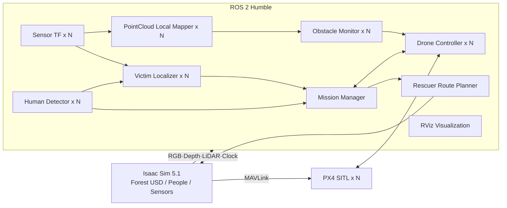

# B3 협동 3 — 산림 조난자 탐지·구조 멀티드론 시스템 V2

> 기준 저장소: `ppiyakkkkk/cobot3`  
> 기준 브랜치: **`main`**  
> 검증 환경: Ubuntu 22.04, ROS 2 Humble, Isaac Sim 5.1, Pegasus Simulator 5.1.x, PX4 SITL 1.14.x

산림 환경에서 여러 대의 드론이 담당 구역을 수색하고, RGB 영상과 Depth를 이용해 조난자의 3D 위치를 추정한 뒤 지상 구조자에게 경로를 제공하는 Isaac Sim 기반 멀티드론 구조 시스템이다.

이 README는 최종 코드가 반영된 `main` 브랜치의 실제 파일과 launch 구성을 기준으로 작성한다. 실행값은 다음 순서로 결정된다.

```text
launch 인자
  > src/forest_rescue_system/config/forest_rescue.yaml
  > Python declare_parameter() 기본값
```

---

## 1. 주요 기능

- 드론 1~4대 동적 생성
- PX4 SITL + MAVSDK Offboard 비행 제어
- Terrain 높이를 반영한 분할 수색 경로
- 드론 이탈·실패 시 협동 수색 구역 재분배
- 360° RTX LiDAR 기반 장애물 감시
- 짧은 PointCloud 누적과 rolling 2D costmap
- FGM(Follow the Gap)·VFH·로컬 A* 기반 수평 회피
- 수평 회피 실패 시 제한적인 수직 회피
- YOLO11 사람 탐지
- RGB Bounding Box + Depth + TF 기반 조난자 위치 추정
- 탐지 드론 Hover, 나머지 드론 복귀·착륙
- 구조자용 2.5D A* 경로계획
- 구조자 Character의 Terrain·다리 지면 추종
- RViz 환경·드론·탐지·경로 시각화
- 정방향·역방향 비행 커버리지 평가
- 3D 매핑 모드 상태 골격

### 현재 구현되지 않은 범위

- `mapping_3d` 모드의 실제 LIO-SAM/SLAM 실행
- 누적 PCD 저장 및 OctoMap/voxel map 생성
- 완성된 3D 매핑 전용 자율 비행
- 실제 기체 배포와 실환경 검증

---

## 2. 전체 동작 흐름



### 탐지·구조 흐름

```text
Isaac RGB
  → YOLO person 후보
  → VictimDetection
  → 같은 촬영 시각의 Depth 선택
  → 카메라 3D 좌표 역투영
  → TF로 map 좌표 변환
  → 연속 탐지·위치 일관성 검증
  → 탐지 드론 Hover
  → 나머지 드론 복귀·착륙
  → /rescue/victim_goal
  → 구조자 2.5D A*
  → /rescue/rescuer_path
  → Isaac Person의 XY 이동과 World Z 지면 추종
```

---

## 3. 저장소 구조

```text
cobot3/
├── isaac_sim/
│   ├── final_24.py                  # Isaac Sim 실행 진입점
│   ├── sim_config.py                # 드론 수·모드·카메라·경로·사람 설정
│   ├── sim_drone.py                 # Iris/PX4/카메라/RTX LiDAR 생성
│   ├── sim_people.py                # 조난자·구조자·지면 추종
│   ├── sim_terrain.py               # Terrain·다리·환경 Mesh 처리
│   ├── sim_utils.py                 # 수색 계획과 Ground Truth 생성
│   ├── sim_viewports.py             # 센서 화면과 추적 카메라
│   └── worlds/my_forest.usdc
├── src/
│   ├── forest_rescue_interfaces/
│   │   └── msg/VictimDetection.msg
│   └── forest_rescue_system/
│       ├── launch/
│       │   ├── forest_rescue_system.launch.py
│       │   ├── forest_rescue_pc_a.launch.py
│       │   └── forest_rescue_pc_b.launch.py
│       ├── config/
│       │   ├── forest_rescue.yaml
│       │   └── forest_rescue_1~4.rviz
│       └── forest_rescue_system/
│           ├── bringup/
│           ├── common/
│           ├── detection/
│           ├── drone/
│           ├── mission/
│           ├── rescuer/
│           └── visualization/
├── scripts/
│   ├── build_ros2.sh
│   ├── setup_integration_env.sh
│   ├── check_yolo_setup.sh
│   └── validate_v2_step1_dynamic_fleet.py
├── models/
├── detected_images/
├── coverage_results/
├── requirements.txt
└── README.md
```

Isaac Sim 실행 시 다음 파일이 현재 모드와 드론 수에 맞게 다시 생성된다.

```text
isaac_sim/generated_search_plan.json
isaac_sim/generated_ground_truth.json
isaac_sim/generated_terrain_mesh.npz
isaac_sim/generated_navigation_surface.npz
isaac_sim/generated_environment_meshes.npz
```

따라서 **Isaac Sim을 ROS launch보다 먼저 실행**해야 한다.

---

## 4. 운용 모드

| 모드 | 상태 | 사람 생성 | PC B 필요 | 설명 |
|---|---:|---:|---:|---|
| `rescue_search` | 구현 | O | O | 수색·탐지·위치 추정·구조자 경로 |
| `eval_coverage` | 구현 | X | X | 정방향+역방향 카메라 커버리지 평가 |
| `mapping_3d` | 골격 | X | X | 이륙·Hover·상태·착륙만 구현 |

드론 수는 `1~4`를 지원한다. Isaac Sim과 ROS launch의 `drone_count`와 `operation_mode`는 반드시 같아야 한다.

---

## 5. ROS 실행 역할

### 통합 실행

`forest_rescue_system.launch.py`

한 PC에서 PC A와 PC B 역할의 모든 노드를 실행한다.

### PC A

`forest_rescue_pc_a.launch.py`

- mission/mapping/coverage manager
- 드론별 MAVSDK controller
- sensor TF
- PointCloud local mapper
- obstacle monitor
- 구조자 경로계획기
- RViz 데이터 시각화 노드
- 선택적 RViz 프로그램

### PC B

`forest_rescue_pc_b.launch.py`

`rescue_search`에서만 다음 GPU 중심 노드를 실행한다.

- 드론별 YOLO human detector
- 드론별 RGB-D victim localizer

`mapping_3d`와 `eval_coverage`에서는 PC B launch가 실행할 노드가 없다.

---

## 6. 필수 환경

### 공통

- Ubuntu 22.04
- ROS 2 Humble
- Python 3.10
- `ROS_DOMAIN_ID=143`
- `RMW_IMPLEMENTATION=rmw_fastrtps_cpp`
- 분산 실행 시 `ROS_LOCALHOST_ONLY=0`

### Isaac Sim/PX4 실행 PC

- NVIDIA GPU와 정상 동작하는 드라이버
- Isaac Sim 5.1
- Pegasus Simulator 5.1.x
- PX4-Autopilot 1.14.x
- `px4_sitl_default` 빌드
- MAVSDK
- Open3D, SciPy

### YOLO 실행 PC

- ROS 2 Humble
- CUDA 사용 가능한 PyTorch 환경 권장
- Ultralytics YOLO
- OpenCV, cv_bridge
- NumPy 1.26.4

---

## 7. 설치

### 7.1 Clone

```bash
cd ~
git clone --branch main https://github.com/ppiyakkkkk/cobot3.git b3_cobot3_ws
cd ~/b3_cobot3_ws
git branch --show-current
```

출력은 `main`이어야 한다.

### 7.2 ROS 의존성

ROS 2 Humble을 설치하고 현재 터미널에 적용한다.

```bash
source /opt/ros/humble/setup.bash
```

패키지 의존성은 workspace 루트에서 설치한다.

```bash
cd ~/b3_cobot3_ws
rosdep update
rosdep install --from-paths src --ignore-src -r -y
```

### 7.3 Python 가상환경

프로젝트는 ROS apt Python 패키지를 함께 사용하므로 `--system-site-packages`가 필요하다.

```bash
python3 -m venv --system-site-packages ~/venvs/pegasus_control
source ~/venvs/pegasus_control/bin/activate
```

의존성과 YOLO11 가중치를 준비한다.

```bash
cd ~/b3_cobot3_ws
bash scripts/setup_integration_env.sh --with-yolo
bash scripts/check_yolo_setup.sh
```

이미 사용하는 alias가 있다면 아래 두 명령으로 같은 환경을 준비해도 된다.

```bash
ros_setup
mavsdk_on
```

### 7.4 ROS workspace 빌드

```bash
cd ~/b3_cobot3_ws
source /opt/ros/humble/setup.bash
source ~/venvs/pegasus_control/bin/activate
bash scripts/build_ros2.sh
source install/setup.bash
```

코드 또는 YAML을 바꾼 뒤에는 다시 빌드하고 `install/setup.bash`를 source한다.

---

## 8. 실행 전 공통 환경

ROS 터미널마다 다음 환경을 맞춘다.

```bash
export ROS_DOMAIN_ID=143
export RMW_IMPLEMENTATION=rmw_fastrtps_cpp
export ROS_LOCALHOST_ONLY=0

source /opt/ros/humble/setup.bash
source ~/venvs/pegasus_control/bin/activate
source ~/b3_cobot3_ws/install/setup.bash
```

`ros_setup`, `mavsdk_on` alias를 구성했다면 해당 alias를 사용해도 된다.

---

## 9. 단일 PC 통합 실행

아래 예시는 드론 3대의 `rescue_search` 모드다.

### 터미널 1 — Isaac Sim과 PX4 SITL

```bash
cd ~/b3_cobot3_ws/isaac_sim
isaac_python final_24.py \
  --drone_count 3 \
  --operation_mode rescue_search
```

`isaac_python` alias가 없다면 설치한 Isaac Sim의 `python.sh` 실제 경로를 사용한다.

```bash
/path/to/isaac-sim/python.sh final_24.py \
  --drone_count 3 \
  --operation_mode rescue_search
```

Isaac 로그에서 다음을 확인한다.

- forest USD 로드
- 드론 3대 생성
- PX4 SITL 연결
- `/clock` 발행
- generated JSON/NPZ 생성
- RGB/Depth/LiDAR 센서 생성
- 구조자와 조난자 생성

### 터미널 2 — ROS 통합 launch

```bash
cd ~/b3_cobot3_ws
ros_setup
mavsdk_on
source install/setup.bash

ros2 launch forest_rescue_system forest_rescue_system.launch.py \
  drone_count:=3 \
  operation_mode:=rescue_search \
  use_sim_time:=true \
  use_rviz:=false
```

### 터미널 3 — 수동 RViz

현재 프로젝트는 RViz 수동 실행을 기본으로 사용한다.

```bash
cd ~/b3_cobot3_ws
ros_setup
source install/setup.bash

rviz2 -d "$(ros2 pkg prefix forest_rescue_system)/share/forest_rescue_system/config/forest_rescue_3.rviz"
```

드론 수에 따라 `forest_rescue_1.rviz`부터 `forest_rescue_4.rviz`까지 선택한다.

### 터미널 4 — 임무 시작

모든 드론이 `READY` 상태가 된 뒤 실행한다.

```bash
ros2 service call /mission/start std_srvs/srv/Trigger "{}"
```

착륙 명령:

```bash
ros2 service call /mission/land std_srvs/srv/Trigger "{}"
```

권장 실행 순서:

```text
Isaac Sim → ROS launch → RViz → /mission/start
```

---

## 10. 한 PC에서 PC A/B 분리 실행

통합 launch와 A/B launch를 동시에 실행하면 노드가 중복되므로 함께 실행하지 않는다.

### 터미널 1 — Isaac Sim

```bash
cd ~/b3_cobot3_ws/isaac_sim
isaac_python final_24.py \
  --drone_count 3 \
  --operation_mode rescue_search
```

### 터미널 2 — PC A 역할

```bash
cd ~/b3_cobot3_ws
ros_setup
mavsdk_on
source install/setup.bash

ros2 launch forest_rescue_system forest_rescue_pc_a.launch.py \
  drone_count:=3 \
  operation_mode:=rescue_search \
  use_sim_time:=true \
  use_rviz:=false
```

### 터미널 3 — PC B 역할

```bash
cd ~/b3_cobot3_ws
ros_setup
mavsdk_on
source install/setup.bash

ros2 launch forest_rescue_system forest_rescue_pc_b.launch.py \
  drone_count:=3 \
  operation_mode:=rescue_search \
  use_sim_time:=true
```

### 터미널 4 — 임무 시작

```bash
ros2 service call /mission/start std_srvs/srv/Trigger "{}"
```

권장 실행 순서:

```text
Isaac Sim → PC A launch → PC B launch → /mission/start
```

---

## 11. 두 PC 분산 실행

두 PC 모두 다음 조건을 맞춘다.

- 같은 `main` commit
- 같은 `ROS_DOMAIN_ID`
- 같은 `RMW_IMPLEMENTATION`
- `ROS_LOCALHOST_ONLY=0`
- 서로 ping 가능
- 방화벽이 DDS UDP 통신을 막지 않음
- 같은 `drone_count`와 `operation_mode`

### PC A

PC A에서 Isaac Sim, PX4 SITL, 제어·미션·LiDAR·구조자·시각화를 실행한다.

```bash
# 터미널 1
cd ~/b3_cobot3_ws/isaac_sim
isaac_python final_24.py \
  --drone_count 3 \
  --operation_mode rescue_search
```

```bash
# 터미널 2
cd ~/b3_cobot3_ws
ros_setup
mavsdk_on
source install/setup.bash

ros2 launch forest_rescue_system forest_rescue_pc_a.launch.py \
  drone_count:=3 \
  operation_mode:=rescue_search \
  use_sim_time:=true \
  use_rviz:=false
```

### PC B

PC B는 YOLO와 RGB-D localizer를 실행한다. Isaac Sim과 PX4는 필요하지 않지만 ROS 2, 동일한 workspace 빌드, venv와 YOLO 가중치가 필요하다.

```bash
cd ~/b3_cobot3_ws
ros_setup
mavsdk_on
source install/setup.bash

ros2 launch forest_rescue_system forest_rescue_pc_b.launch.py \
  drone_count:=3 \
  operation_mode:=rescue_search \
  use_sim_time:=true
```

### DDS 확인

```bash
ros2 topic hz /quadrotor_01/Camera/rgb
ros2 topic echo /mission/state --once
```

PC B에서 RGB 토픽이 보이지 않으면 코드보다 DDS, 네트워크, 방화벽 설정을 먼저 확인한다.

---

## 12. 다른 모드 실행

### 12.1 커버리지 평가

PC B는 필요하지 않다.

```bash
# Isaac Sim
cd ~/b3_cobot3_ws/isaac_sim
isaac_python final_24.py \
  --drone_count 3 \
  --operation_mode eval_coverage
```

```bash
# ROS PC A
ros2 launch forest_rescue_system forest_rescue_pc_a.launch.py \
  drone_count:=3 \
  operation_mode:=eval_coverage \
  use_sim_time:=true \
  use_rviz:=false
```

```bash
ros2 service call /mission/start std_srvs/srv/Trigger "{}"
```

결과 JSON은 `coverage_results/`에 저장된다.

### 12.2 3D 매핑 골격

```bash
# Isaac Sim
cd ~/b3_cobot3_ws/isaac_sim
isaac_python final_24.py \
  --drone_count 1 \
  --operation_mode mapping_3d
```

```bash
# ROS PC A
ros2 launch forest_rescue_system forest_rescue_pc_a.launch.py \
  drone_count:=1 \
  operation_mode:=mapping_3d \
  use_sim_time:=true \
  use_rviz:=false
```

현재는 `/mission/start` 호출 시 `MAPPING_NOT_IMPLEMENTED` 상태를 알리며 실제 SLAM 비행은 시작하지 않는다.

---

## 13. 현재 주요 설정값

실제 운용값은 `src/forest_rescue_system/config/forest_rescue.yaml`에서 확인한다.

| 항목 | 현재 YAML 값 |
|---|---:|
| YOLO confidence | `0.4` |
| 연속 탐지 횟수 | `2` |
| 탐지 시작 지연 | `10.0 s` |
| 탐지 위치 대기 | `6.0 s` |
| 구조자 최대 경사 | `45°` |
| 구조자 최대 단차 | `1.25 m` |
| 로컬 grid 크기 | `12.0 m` |
| 로컬 grid 해상도 | `0.25 m` |
| 장애물 inflation | `0.7 m` |

Python 코드의 fallback 기본값과 YAML이 다를 수 있으므로, 값 변경 전 YAML과 launch를 함께 확인한다.

---

## 14. 드론 장애물 회피

### PointCloud local mapper

- LiDAR scan을 timestamp TF로 `map`에 고정
- 짧은 sliding window 유지
- voxel observation 수로 일시적 노이즈 감소
- 현재 body frame으로 재변환
- rolling 2D OccupancyGrid 발행

### Obstacle monitor

수평 회피 후보는 다음 정보를 함께 사용한다.

- FGM: LiDAR의 연속된 빈 통로 탐색
- VFH: 여러 후보 각도의 여유 거리 평가
- 로컬 A*: 누적 PointCloud 기반 근거리 우회 방향
- 원래 목표 방향의 전진 성분
- 이전 회피 방향 유지 성향

로컬 A*는 장거리 전역 경로가 아니라 가까운 **우회 방향 힌트**로 사용된다. 수평 후보가 모두 실패한 경우에만 controller가 제한적인 수직 회피를 수행한다.

---

## 15. 조난자 탐지와 위치 추정

### Human detector

- `detector_mode=yolo` 또는 `mock`
- person class만 사용
- 최신 RGB를 설정된 추론 주기로 처리
- `VictimDetection`에 RGB 크기와 bbox 포함
- 확정 탐지 이미지를 `detected_images/`에 저장

### Victim localizer

- RGB 촬영 stamp와 가장 가까운 Depth 선택
- bbox를 Depth 해상도로 변환
- ROI 유효 Depth로 카메라 3D 좌표 역투영
- camera optical frame에서 `map`으로 TF 변환
- Depth 또는 TF가 늦으면 제한 시간 동안 비동기 재시도

### Mission manager 검증

- 탐지 시작 유예
- 시작 위치 제외 반경
- confidence
- 시간창 내 연속 탐지
- 같은 stamp의 map 위치
- 여러 위치의 공간적 일관성

을 함께 검사한다.

---

## 16. 구조자 경로계획

구조자 경로는 단순 평면 2D A*가 아니라 **2.5D 격자 A***다.

- 탐색 인덱스: XY 격자
- 셀 데이터: navigation surface Z
- 보행 가능성: 경사 제한
- 셀 전이: 높이 단차 제한
- 비용: 수평 거리 + 경사 비용
- 강·바위·이착륙 플랫폼: 차단
- 다리: 강 위의 통행 가능 구조물
- 최종 Path: XYZ 포함

Isaac 구조자는 XY 경로를 따라 걷고, 매 프레임 Terrain 또는 다리 표면을 조회해 World Z를 보정한다. 유효한 지면을 찾지 못하면 `GROUND_LOST` 상태로 정지한다.

---

## 17. 주요 ROS 인터페이스

| 종류 | 이름 | 역할 |
|---|---|---|
| Service | `/mission/start` | 현재 모드 시작 |
| Service | `/mission/land` | 드론 착륙 |
| Topic | `/mission/mode` | 운용 모드 |
| Topic | `/mission/state` | 전체 상태 |
| Topic | `/mission/finder_drone` | 확정 탐지 드론 |
| Topic | `/drone_XX/command` | 드론 명령 |
| Topic | `/drone_XX/status` | 드론 상태 |
| Topic | `/drone_XX/victim/detection` | 탐지 bbox |
| Topic | `/drone_XX/victim/position_camera` | 카메라 좌표 위치 |
| Topic | `/drone_XX/victim/position_map` | map 좌표 위치 |
| Topic | `/drone_XX/obstacle/local_astar_path` | 로컬 A* 시각화 경로 |
| Topic | `/rescue/victim_goal` | 확정 조난자 목표 |
| Topic | `/rescue/rescuer_path` | 구조자 XYZ 경로 |
| Topic | `/rescue/rescuer/status` | 구조자 상태 |
| Topic | `/rescue/rescuer/route_status` | 경로계획 상태 |
| Topic | `/forest_rescue/scene_markers` | 장면 Marker |
| Topic | `/clock` | Isaac simulation time |

---

## 18. 상태 확인

```bash
ros2 topic echo /mission/state --once
ros2 topic echo /mission/mode --once
ros2 topic echo /mission/finder_drone --once
ros2 topic echo /rescue/rescuer/route_status --once

ros2 topic hz /quadrotor_01/Camera/rgb
ros2 topic hz /quadrotor_01/Camera/depth
ros2 topic hz /quadrotor_01/point_cloud

ros2 topic echo /clock --once
ros2 param get /mission_manager_node use_sim_time
```

---

## 19. 정적 검증

```bash
cd ~/b3_cobot3_ws
python3 scripts/validate_v2_step1_dynamic_fleet.py
python3 -m compileall -q src scripts isaac_sim
```

검증 스크립트는 다음을 확인한다.

- ROS 패키지 구조
- 드론 1~4대 설정
- 세 운용 모드
- 통합 launch = PC A launch + PC B launch
- Python 문법
- 핵심 YAML과 entry point

---

## 20. 문제 해결

### venv에서 `rclpy` 또는 `cv_bridge` import 실패

가상환경을 `--system-site-packages`로 생성해야 한다.

```bash
python3 -m venv --system-site-packages ~/venvs/pegasus_control
```

적용 순서:

```bash
source /opt/ros/humble/setup.bash
source ~/venvs/pegasus_control/bin/activate
source ~/b3_cobot3_ws/install/setup.bash
```

### `librcl_logging_spdlog.so: undefined symbol`

Conda 라이브러리나 별도 `fmt`/`spdlog`가 ROS apt 라이브러리보다 먼저 로드되는지 확인한다.

```bash
env | grep -E 'CONDA|LD_LIBRARY_PATH|PYTHONPATH'
```

새 터미널에서 ROS와 venv를 다시 적용한다.

### NumPy 2.x와 cv_bridge 충돌

```bash
source ~/venvs/pegasus_control/bin/activate
python -m pip install --force-reinstall "numpy==1.26.4"
```

### YOLO 모델 없음

```bash
cd ~/b3_cobot3_ws
bash scripts/setup_integration_env.sh --with-yolo
bash scripts/check_yolo_setup.sh
```

### 구조자 경로계획기가 지도 파일을 기다림

Isaac Sim을 먼저 실행해 generated 파일을 만든다. Isaac과 ROS의 `drone_count`, `operation_mode`가 같은지 확인한다.

### RViz Message Filter drop 또는 TF 시간 오류

```bash
ros2 topic echo /clock --once
ros2 param get /mission_manager_node use_sim_time
```

Isaac이 `/clock`을 발행하고 모든 ROS 노드가 `use_sim_time=true`인지 확인한다.

### PX4 SITL 프로세스가 남아 있음

```bash
pgrep -af "px4|px4_sitl"
pkill -f px4
```

다른 PX4 작업도 실행 중이라면 PID를 확인한 후 필요한 프로세스만 종료한다.

---

## 21. 종료 순서

1. `/mission/land` 호출
2. 드론 착륙·Disarm 확인
3. ROS launch 종료
4. RViz 종료
5. Isaac Sim 종료

Isaac Sim을 먼저 종료하면 PX4, 센서 토픽, `/clock`이 동시에 끊겨 원인과 무관한 오류 로그가 많이 발생할 수 있다.

---

## 22. License

BSD-3-Clause
