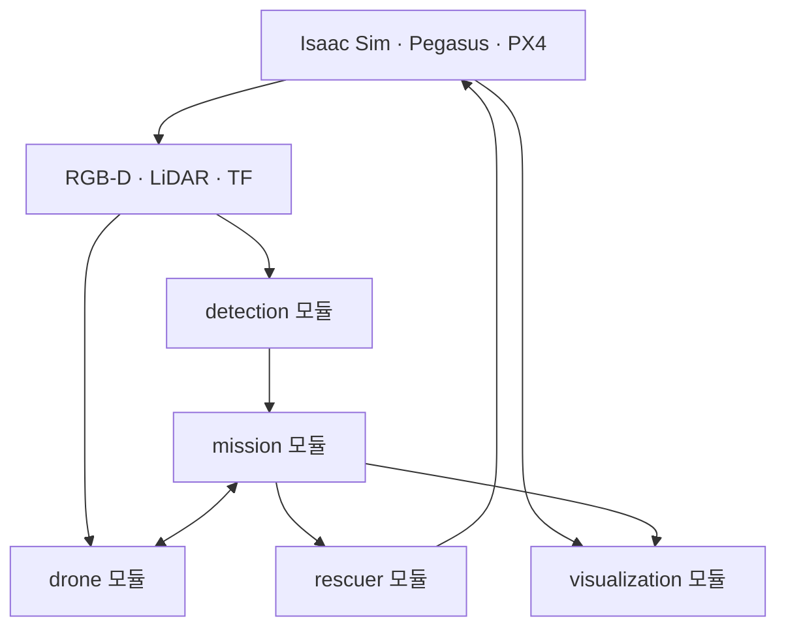

# Forest Rescue Multi-Drone System V2

Isaac Sim 산림 환경에서 최대 4대의 드론이 협동 수색하고, YOLO와 RGB-D로
조난자의 3D 위치를 계산한 뒤 구조자에게 지상 경로를 전달하는 ROS 2 프로젝트입니다.

현재 기준 브랜치는 `feat/jj/v2_updates`입니다.

## 1. 프로젝트 개요

주요 동작은 다음과 같습니다.

1. Isaac Sim에서 산림, 드론, 조난자, 구조자를 생성합니다.
2. Pegasus Simulator와 PX4 SITL을 드론별로 연결합니다.
3. ROS 2 Mission Manager가 드론의 이륙과 수색을 관리합니다.
4. 각 드론은 LiDAR 로컬맵, 로컬 A*, VFH, 수직 회피를 이용해 비행합니다.
5. YOLO가 사람을 탐지하고 RGB-D와 TF가 조난자의 `map` 좌표를 계산합니다.
6. 조난자 위치를 구조자 경로 계획기로 전달합니다.
7. 구조자는 전달받은 경로를 따라 조난자에게 이동합니다.



## 2. V2 패키지 구성

`src/` 바로 아래에는 ROS 2 패키지가 두 개만 있습니다.

| ROS 2 패키지 | 책임 |
|---|---|
| `forest_rescue_interfaces` | `VictimDetection.msg` 사용자 정의 메시지 생성 |
| `forest_rescue_system` | 모든 실행 노드, 설정, 통합/A/B launch |

사용자 정의 메시지는 다른 노드보다 먼저 빌드되어야 하므로 인터페이스만 독립
패키지로 유지합니다. 나머지 기능은 `forest_rescue_system` 안에서 Python
하위 모듈로 구분합니다.

| 기능 모듈 | 책임 | 주요 실행 파일 |
|---|---|---|
| `common` | 공통 시간·로그 기능 | `log_utils.py` |
| `detection` | YOLO 탐지와 RGB-D 위치 계산 | `human_detector`, `victim_localizer` |
| `drone` | 비행, 센서 TF, 로컬맵, 장애물 회피 | `drone_controller`, `sensor_tf`, `pointcloud_local_mapper`, `obstacle_monitor` |
| `mission` | 구조 수색, 매핑, 커버리지 평가 상태 관리 | `mission_manager`, `mapping_manager`, `coverage_evaluation_manager` |
| `rescuer` | 구조자 지상 A* 경로 계획 | `rescuer_route_planner` |
| `visualization` | RViz 장면·드론 표시와 커버리지 계산 | `rviz_visualization`, `coverage_visualization` |
| `bringup` | 통합/PC A/PC B launch의 공통 생성 로직 | `launch_common.py` |

이번 구조 변경에서는 기존 토픽, 서비스, 파라미터, 노드 이름과 알고리즘을
유지했습니다. 구조자 보행 알고리즘도 수정하지 않았습니다.

## 3. 저장소 구조

```text
b3_cobot3_ws/
├── isaac_sim/
│   ├── final_24.py
│   ├── sim_config.py
│   ├── sim_drone.py
│   ├── sim_people.py
│   ├── sim_terrain.py
│   ├── sim_utils.py
│   ├── sim_viewports.py
│   ├── generated_ground_truth.json
│   ├── generated_search_plan.json
│   ├── generated_terrain_mesh.npz
│   ├── generated_environment_meshes.npz
│   ├── generated_navigation_surface.npz
│   └── worlds/
├── scripts/
│   ├── build_ros2.sh
│   ├── setup_integration_env.sh
│   ├── check_yolo_setup.sh
│   └── validate_v2_step1_dynamic_fleet.py
├── src/
│   ├── forest_rescue_interfaces/
│   │   └── msg/VictimDetection.msg
│   └── forest_rescue_system/
│       ├── config/
│       ├── launch/
│       │   ├── forest_rescue_system.launch.py
│       │   ├── forest_rescue_pc_a.launch.py
│       │   └── forest_rescue_pc_b.launch.py
│       └── forest_rescue_system/
│           ├── bringup/
│           ├── common/
│           ├── detection/
│           ├── drone/
│           ├── mission/
│           ├── rescuer/
│           └── visualization/
├── requirements.txt
└── README.md
```

`build/`, `install/`, `log/`, `models/`는 로컬에서 생성하며 Git에 올리지 않습니다.

## 4. 검증 환경

- Ubuntu 22.04
- Python 3.10
- ROS 2 Humble
- Isaac Sim 5.1
- Pegasus Simulator 5.1.0
- PX4-Autopilot 1.14.3
- MAVSDK
- Ultralytics YOLO 8.4.101
- Open3D 0.19.0
- SciPy 1.15.3
- NumPy 1.26.4
- OpenCV 4.11.0.86
- `ROS_DOMAIN_ID=143`
- `RMW_IMPLEMENTATION=rmw_fastrtps_cpp`

Isaac Sim, Pegasus Simulator, PX4, ROS 2는 이 저장소에 포함되지 않습니다.
각 프로그램을 먼저 설치해야 합니다.

## 5. 브랜치 받기

새로 클론하는 경우:

```bash
cd ~

git clone \
  --branch feat/jj/v2_updates \
  --single-branch \
  https://github.com/ppiyakkkkk/cobot3.git \
  b3_cobot3_ws

cd ~/b3_cobot3_ws
```

기존 저장소를 현재 원격 브랜치와 맞추는 경우:

```bash
cd ~/b3_cobot3_ws

git fetch origin
git switch feat/jj/v2_updates
git pull --ff-only origin feat/jj/v2_updates
```

로컬 커밋을 강제로 되돌리는 명령은 작업을 잃을 수 있으므로, 실행 전에
`git status`와 `git log --oneline -5`를 확인합니다.

## 6. 환경 설정

이 프로젝트는 다음 alias가 준비되어 있다고 가정합니다.

```bash
ros_setup
isaac_ros_setup
mavsdk_on
isaac_python
```

공통 통신 환경:

```bash
export ROS_DOMAIN_ID=143
export RMW_IMPLEMENTATION=rmw_fastrtps_cpp
```

MAVSDK/YOLO/Open3D용 가상환경은 현재 다음 위치를 사용합니다.

```text
~/venvs/pegasus_control
```

처음 한 번 의존성과 YOLO 가중치를 준비합니다.

```bash
cd ~/b3_cobot3_ws

source ~/.bashrc
ros_setup
mavsdk_on

bash scripts/setup_integration_env.sh --with-yolo
bash scripts/check_yolo_setup.sh
```

기본 모델 저장 위치:

```text
~/b3_cobot3_ws/models/yolo11s.pt
```

모델 파일명을 바꾸면 `src/forest_rescue_system/config/forest_rescue.yaml`의
`model_path`도 함께 변경해야 합니다.

## 7. 빌드

```bash
cd ~/b3_cobot3_ws

source ~/.bashrc
ros_setup
mavsdk_on

bash scripts/build_ros2.sh
source install/setup.bash
```

패키지 확인:

```bash
ros2 pkg list | grep -E \
  "^(forest_rescue_interfaces|forest_rescue_system)$"
```

메시지 확인:

```bash
ros2 interface show forest_rescue_interfaces/msg/VictimDetection
```

## 8. 실행 순서

`drone_count`와 `operation_mode`는 Isaac Sim과 ROS 2 launch에서 반드시
동일하게 지정해야 합니다.

지원하는 드론 수는 1~4대이며 기본값은 3대입니다.

### 터미널 1: Isaac Sim과 PX4 실행

```bash
cd ~/b3_cobot3_ws

source ~/.bashrc
ros_setup
isaac_ros_setup

isaac_python isaac_sim/final_24.py \
  --drone_count 3 \
  --operation_mode rescue_search
```

이 실행에서 산림과 로봇을 생성하고 다음 파일을 갱신합니다.

- `isaac_sim/generated_ground_truth.json`
- `isaac_sim/generated_search_plan.json`
- `isaac_sim/generated_terrain_mesh.npz`
- `isaac_sim/generated_environment_meshes.npz`
- `isaac_sim/generated_navigation_surface.npz`

Isaac Sim에서 드론과 PX4 연결이 준비된 뒤 ROS 2 launch를 실행합니다.

왼쪽 메인 Viewport 단축키:

| 키 | 동작 |
|---|---|
| `1`~`4` | 해당 드론의 기존 3인칭 추적 시점 |
| `8` | 조난자를 주변 지형과 함께 보는 상공 추적 시점 |
| `9` | 구조자를 주변 지형과 함께 보는 상공 추적 시점 |
| `0` | 카메라 잠금을 풀고 마우스로 조작하는 자유 시점 |
| `F` | 다음 드론 추적 |

`0`으로 자유 시점에 들어간 뒤에도 `1`~`4`, `8`, `9`를 누르면 전용
추적 카메라와 해당 시점으로 즉시 돌아옵니다. `8`, `9`는 조난자와 구조자가
생성되는 `rescue_search` 모드에서 사용합니다.

### 한 PC 개발·기능 검증

코드를 수정한 뒤 한 컴퓨터에서 전체 기능을 확인할 때는 통합 launch를
사용합니다.

```bash
cd ~/b3_cobot3_ws

source ~/.bashrc
ros_setup
mavsdk_on
source install/setup.bash

ros2 launch forest_rescue_system \
  forest_rescue_system.launch.py \
  drone_count:=3 \
  operation_mode:=rescue_search \
  use_rviz:=false
```

### 두 PC 최종 실행

두 PC는 같은 Git 커밋을 체크아웃하고 각각 한 번씩 빌드해야 합니다.
두 터미널 모두 아래 통신 값을 같게 설정합니다.

```bash
export ROS_DOMAIN_ID=143
export RMW_IMPLEMENTATION=rmw_fastrtps_cpp
export ROS_LOCALHOST_ONLY=0
```

두 PC의 `drone_count`, `operation_mode`, 인터페이스 빌드 결과도 같아야
합니다. 같은 LAN에서 DDS multicast와 UDP 통신이 방화벽에 막히지 않아야
합니다.

PC A는 Isaac Sim·PX4와 다음 launch를 실행합니다.

```bash
cd ~/b3_cobot3_ws
source ~/.bashrc
ros_setup
mavsdk_on
source install/setup.bash

ros2 launch forest_rescue_system \
  forest_rescue_pc_a.launch.py \
  drone_count:=3 \
  operation_mode:=rescue_search \
  use_rviz:=false
```

PC B는 YOLO와 RGB-D 위치 추정 launch를 실행합니다.

```bash
cd ~/b3_cobot3_ws
source ~/.bashrc
ros_setup
mavsdk_on
source install/setup.bash

ros2 launch forest_rescue_system \
  forest_rescue_pc_b.launch.py \
  drone_count:=3 \
  operation_mode:=rescue_search
```

역할 분리는 다음과 같습니다.

| 실행 파일 | 실행 노드 |
|---|---|
| 통합 | PC A 노드 + PC B 노드 전체 |
| PC A | 미션, 드론 제어, 센서 TF, LiDAR 로컬맵·회피, 구조자 경로, 시각화 |
| PC B | YOLO 탐지, RGB-D 조난자 위치 추정 |

따라서 `forest_rescue_pc_a.launch.py`와
`forest_rescue_pc_b.launch.py`를 동시에 실행한 노드 구성은 통합 launch와
같습니다. 동일한 노드를 중복 실행하지 않도록 두 PC 환경에서는 통합 launch를
함께 실행하지 않습니다.

한 PC에서 A/B 분리 구성을 시험할 때의 권장 시작 순서는
`Isaac Sim → PC A launch → PC B launch → /mission/start`입니다. A와 B의
선후 자체가 필수 통신 조건은 아니지만, 제어·미션 쪽인 A가 준비된 뒤 탐지 쪽
B를 켜면 로그와 준비 상태를 확인하기 쉽습니다.

RViz까지 launch에서 실행하려면 PC A 또는 통합 launch에서만
`use_rviz:=true`로 바꿉니다. 현재 프로젝트 선호대로 RViz를 별도
실행하려면 아래 명령을 사용합니다.

### 임무 시작

```bash
cd ~/b3_cobot3_ws

source ~/.bashrc
ros_setup
source install/setup.bash

ros2 service call /mission/start std_srvs/srv/Trigger "{}"
```

착륙:

```bash
ros2 service call /mission/land std_srvs/srv/Trigger "{}"
```

### RViz와 상태 확인

```bash
cd ~/b3_cobot3_ws

source ~/.bashrc
ros_setup
source install/setup.bash

rviz2 -d \
  "$(ros2 pkg prefix forest_rescue_system)/share/forest_rescue_system/config/forest_rescue_3.rviz"
```

상태와 주요 토픽 확인:

```bash
ros2 topic echo /mission/state
ros2 topic echo /mission/finder_drone
ros2 topic echo /rescue/rescuer/route_status
ros2 topic hz /quadrotor_01/Camera/rgb
ros2 topic hz /quadrotor_01/point_cloud
```

## 9. 운용 모드

### `rescue_search`

현재 주 동작 모드입니다.

- 자동 이륙
- 다중 드론 수색
- LiDAR 장애물 회피
- YOLO 사람 탐지
- RGB-D 조난자 좌표 계산
- 구조자 지상 경로 생성
- 미탐지 드론 복귀 및 착륙

### `eval_coverage`

카메라가 실제로 관측한 지형 삼각형을 누적해 드론별·전체 커버리지를 계산합니다.

```bash
isaac_python isaac_sim/final_24.py \
  --drone_count 3 \
  --operation_mode eval_coverage
```

ROS 2 launch:

```bash
ros2 launch forest_rescue_system \
  forest_rescue_system.launch.py \
  drone_count:=3 \
  operation_mode:=eval_coverage
```

결과는 `coverage_results/`에 JSON으로 저장됩니다.

### `mapping_3d`

V2의 3D 지도 생성 진입점과 상태 관리 구조만 마련되어 있습니다.
실제 LIO-SAM 지도 생성과 저장 파이프라인은 아직 구현 중입니다.

## 10. 기능 모듈별 노드

### `detection`

`human_detector`

- RGB 영상에서 사람 클래스 탐지
- 연속 탐지 검증용 `VictimDetection` 발행
- 파란색 bounding box가 포함된 영상 발행
- 확인된 탐지 이미지 저장

`victim_localizer`

- 탐지 bbox와 같은 시점의 Depth 탐색
- 카메라 내부 파라미터로 3D 위치 계산
- TF를 이용해 카메라 좌표를 `map` 좌표로 변환

### `drone`

`drone_controller`

- MAVSDK-PX4 연결
- 이륙, 수색, 호버, 복귀, 착륙
- 협동 수색 경로 실행
- 로컬 A*, VFH, 수직 회피 결과 실행

`pointcloud_local_mapper`

- LiDAR 포인트를 `map` 좌표에 누적
- 드론 중심 로컬 2D OccupancyGrid 생성
- 오래된 프레임 제거와 voxel 확정

`obstacle_monitor`

- 전·좌·우 및 360° 장애물 거리 계산
- 진행 방향 통로 검사
- 로컬 A* 우회점과 VFH 후보 방향 발행

`sensor_tf`

- 드론 base와 RGB-D/LiDAR 센서 사이 정적 TF 발행

### `mission`

`mission_manager`

- 전체 구조 수색 상태 관리
- 특정 드론의 오류 격리
- 조난자 탐지와 map 위치의 동일 stamp 검증
- 협동 수색 계획 생성
- 구조자 도착까지 최종 완료 조건 관리

`mapping_manager`

- `mapping_3d` 모드의 상태와 드론 명령 관리
- 실제 지도 생성 기능은 구현 예정

`coverage_evaluation_manager`

- 전진·역방향 커버리지 평가 단계 관리
- 커버리지 스냅샷과 결과 JSON 저장

### `rescuer`

`rescuer_route_planner`

- 사전 생성한 navigation surface를 2D 격자로 변환
- 급경사, 강, 바위, 교량 조건을 반영한 A* 수행
- 조난자 주변 stand-off 지점까지 경로 발행

현재 알려진 한계:

- 구조자 보행과 지면 추종은 아직 산 경사에서 안정적이지 않습니다.
- 경사 한계와 스폰 위치는 추가 검증이 필요합니다.
- 이번 패키지 분리에서는 해당 알고리즘을 변경하지 않았습니다.

### `visualization`

- 산림 지형과 환경 mesh 표시
- 드론 위치와 수색 관련 marker 표시
- `eval_coverage` 모드의 카메라 가시 영역 계산 및 표시

## 11. 주요 ROS 2 인터페이스

| 종류 | 이름 | 역할 |
|---|---|---|
| Service | `/mission/start` | 현재 모드의 임무 시작 |
| Service | `/mission/land` | 전체 드론 착륙 |
| Topic | `/mission/state` | 전체 임무 상태 |
| Topic | `/mission/finder_drone` | 조난자 탐지 드론 |
| Topic | `/drone_XX/victim/detection` | 드론별 탐지 결과 |
| Topic | `/drone_XX/victim/position_map` | 드론별 조난자 map 좌표 |
| Topic | `/rescue/victim_goal` | 구조자에게 전달할 조난자 위치 |
| Topic | `/rescue/rescuer_path` | 구조자 지상 경로 |
| Topic | `/rescue/rescuer/route_status` | 경로 계획 상태 |
| Topic | `/forest_rescue/scene_markers` | RViz 장면 marker |

## 12. 설정 파일

공통 설정:

```text
src/forest_rescue_system/config/forest_rescue.yaml
```

주요 설정 범위:

- 드론별 MAVSDK 주소와 서버 포트
- 카메라, Depth, PointCloud 토픽
- YOLO 모델, confidence, 탐지 주기
- 탐지 지연과 시작 지점 제외 영역
- 로컬맵 크기, 해상도, voxel 설정
- A*, VFH, 수직 회피 임계값
- 수색 고도와 waypoint
- 구조자 경사, 강, 교량, 장애물 비용
- 커버리지 평가 주기와 결과 경로

설정이나 Python 코드를 바꾼 뒤:

```bash
bash scripts/build_ros2.sh
source install/setup.bash
```

## 13. 정적 검증

Isaac Sim을 실행하지 않고 드론 수, 두 패키지 구조, 기능 모듈 import와
통합/A/B launch 역할을 검사합니다.

```bash
cd ~/b3_cobot3_ws

python3 scripts/validate_v2_step1_dynamic_fleet.py
python3 -m compileall -q src
```

ROS 환경이 준비된 PC에서는 전체 빌드까지 확인합니다.

```bash
ros_setup
mavsdk_on
bash scripts/build_ros2.sh
```

## 14. 문제 해결

### `No module named rclpy`

먼저 ROS 환경을 적용한 뒤 가상환경을 활성화합니다.

```bash
ros_setup
mavsdk_on
```

가상환경은 ROS 2 apt 패키지를 볼 수 있도록 구성되어야 합니다.

### `librcl_logging_spdlog.so: undefined symbol`

가상환경의 라이브러리가 ROS 2 Humble의 `fmt`/`spdlog`보다 먼저 잡힌 경우가 많습니다.
새 터미널에서 `ros_setup`과 `mavsdk_on`을 다시 적용하고
`scripts/setup_integration_env.sh` 검사를 통과하는지 확인합니다.

### NumPy 2.x 관련 `cv_bridge` 오류

이 프로젝트는 NumPy 1.26.4를 기준으로 합니다.

```bash
python -m pip install --upgrade --force-reinstall "numpy==1.26.4"
```

실행 노드의 Python이 예상한 가상환경인지도 확인합니다.

```bash
which python
pgrep -af "human_detector|drone_controller"
```

### YOLO 모델을 찾지 못함

```bash
bash scripts/setup_integration_env.sh --with-yolo
bash scripts/check_yolo_setup.sh
```

### 수색 계획 또는 지형 파일 불일치

Isaac Sim의 `final_24.py`를 먼저 실행해 생성 파일을 갱신한 뒤 ROS 2 launch를
시작합니다. Isaac Sim과 launch의 `drone_count`, `operation_mode`도 같아야 합니다.

### RViz Message Filter drop

Isaac Sim이 `/clock`을 발행하고 있는지, launch에 `use_sim_time:=true`가
전달되었는지 확인합니다.

```bash
ros2 topic echo /clock --once
ros2 param get /mission_manager_node use_sim_time
```

## 15. 종료 순서

1. `/mission/land` 호출
2. ROS 2 launch 종료
3. RViz 종료
4. Isaac Sim 종료

Isaac Sim을 먼저 끄면 PX4 연결과 센서 토픽이 동시에 끊길 수 있습니다.

## 16. 향후 작업

- 구조자의 산악 지형 보행과 지면 추종 개선
- 구조자 경사 허용값의 실제 경로 기반 재조정
- LIO-SAM 기반 오프라인 3D 지도 생성
- PCD를 OctoMap/voxel map/2D OccupancyGrid로 변환
- 강과 교량을 포함한 구조자 경로 재검증
- 두 PC DDS 통신과 카메라 대역폭의 실제 환경 검증

## 17. License

BSD-3-Clause
