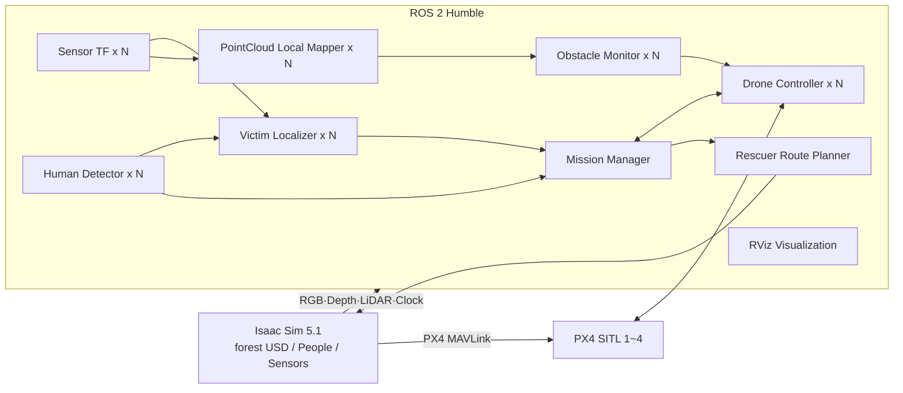

# B3 협동 3 — 산림 조난자 탐지·구조 멀티드론 시스템 V2

> 기준 저장소: `ppiyakkkkk/cobot3`  
> 기준 브랜치: **`feat/jj/v2_updates`**  
> 지원 환경: Ubuntu 22.04, ROS 2 Humble, Isaac Sim 5.1, Pegasus Simulator 5.1.x, PX4 SITL 1.14.x

이 문서는 `feat/jj/v2_updates` 브랜치의 실제 실행 코드와 launch 구성을 기준으로
작성했다. 예전 README나 Python 클래스의 fallback 기본값보다
`src/forest_rescue_system/config/forest_rescue.yaml`과 launch 인자가 실제 실행값에
우선한다.

---

## 1. 프로젝트 목적

산림 환경에서 여러 대의 드론이 담당 구역을 수색하고, RGB 영상의 사람 탐지와
Depth·TF를 이용해 조난자 위치를 계산한 뒤, 지상 구조자에게 안전한 경로를
제공하는 Isaac Sim 기반 구조 시스템이다.

현재 구현 범위:

- 드론 1~4대 동적 생성
- PX4 SITL + MAVSDK Offboard 제어
- Terrain 높이를 반영한 분할 수색 경로
- 협동 수색 구역 재분배
- 360° RTX LiDAR 기반 장애물 감시
- 최근 PointCloud 누적과 rolling 2D costmap
- 로컬 A*·VFH 방향 힌트와 수직 회피
- YOLO11 사람 탐지
- RGB Bounding Box + Depth + TF 조난자 위치 추정
- 탐지 드론 Hover, 다른 드론 복귀·착륙
- 구조자용 2.5D A* 경로계획
- 구조자 Character 지면 추종
- RViz 환경·드론·경로 시각화
- 왕복 카메라 커버리지 평가
- 3D 매핑 모드 상태 골격

아직 구현되지 않은 범위:

- `mapping_3d`의 실제 LIO-SAM/SLAM 실행
- 누적 PCD 저장 및 OctoMap/voxel map 생성
- 매핑 전용 자율 비행 경로

---

## 2. 전체 동작 구조



### 탐지·구조 흐름

```text
Isaac RGB
  → YOLO 사람 후보
  → VictimDetection
  → 같은 촬영 시각의 Depth 선택
  → 카메라 3D 좌표 역투영
  → TF로 map 좌표 변환
  → mission_manager의 연속 탐지·위치 일관성 검증
  → 탐지 드론 Hover
  → 나머지 드론 복귀·착륙
  → /rescue/victim_goal
  → 구조자 2.5D A*
  → /rescue/rescuer_path
  → Isaac Person XY 보행 + World Z 지면 추종
```

---

## 3. 저장소 구조

```text
cobot3/
├── isaac_sim/
│   ├── final_24.py                  # Isaac Sim 실행 진입점
│   ├── sim_config.py                # 드론 수·모드·카메라·경로·사람 설정
│   ├── sim_drone.py                 # Iris/PX4/카메라/RTX LiDAR 생성
│   ├── sim_people.py                # 조난자·구조자·지면 추종·충돌 프록시
│   ├── sim_terrain.py               # Terrain·다리 높이와 환경 Mesh 추출
│   ├── sim_utils.py                 # 수색 계획과 Ground Truth 생성
│   ├── sim_viewports.py             # 센서 화면 도킹과 추적 카메라
│   └── worlds/my_forest.usdc
├── src/
│   ├── forest_rescue_interfaces/
│   │   └── msg/VictimDetection.msg
│   └── forest_rescue_system/
│       ├── launch/
│       ├── config/
│       └── forest_rescue_system/
│           ├── bringup/
│           ├── common/
│           ├── detection/
│           ├── drone/
│           ├── mission/
│           ├── rescuer/
│           └── visualization/
├── scripts/
│   ├── build_ros2.sh
│   ├── setup_integration_env.sh
│   ├── check_yolo_setup.sh
│   ├── validate_v2_step1_dynamic_fleet.py
│   └── v2/                          # 이 문서와 함께 제공하는 재현용 스크립트
├── requirements.txt
└── README.md
```

자동 생성 파일:

```text
isaac_sim/generated_search_plan.json
isaac_sim/generated_ground_truth.json
isaac_sim/generated_terrain_mesh.npz
isaac_sim/generated_navigation_surface.npz
isaac_sim/generated_environment_meshes.npz
```

위 파일들은 **Isaac Sim을 실행할 때 현재 모드와 드론 수에 맞춰 다시 생성된다.**
ROS launch보다 Isaac Sim을 먼저 실행해야 하는 가장 중요한 이유다.

---

## 4. 운용 모드

| 모드 | 구현 상태 | 사람 생성 | PC B 필요 | 설명 |
|---|---:|---:|---:|---|
| `rescue_search` | 구현 | O | O | 수색·탐지·위치 추정·구조자 경로 |
| `eval_coverage` | 구현 | X | X | 정방향+역방향 카메라 커버리지 평가 |
| `mapping_3d` | 골격 | X | X | 이륙·Hover·상태·착륙만 구현 |

드론 수는 `1~4`를 지원하며 Isaac Sim과 ROS launch에 **같은 값**을 전달해야 한다.

---

## 5. 실행 역할

### 통합 실행

`forest_rescue_system.launch.py`

한 PC에서 PC A와 PC B의 모든 노드를 실행한다.

### PC A

`forest_rescue_pc_a.launch.py`

- 모드별 mission manager
- 드론별 MAVSDK controller
- sensor TF
- PointCloud local mapper
- obstacle monitor
- 구조자 경로계획기
- RViz 환경 시각화
- 커버리지 시각화
- 선택적 RViz 프로그램

### PC B

`forest_rescue_pc_b.launch.py`

`rescue_search`에서만 다음 GPU 중심 노드를 실행한다.

- 드론별 YOLO human detector
- 드론별 RGB-D victim localizer

`mapping_3d`와 `eval_coverage`에서는 PC B launch가 실행할 노드가 없다.

---

## 6. 필수 환경

### 공통

- Ubuntu 22.04
- ROS 2 Humble
- Python 3.10
- `ROS_DOMAIN_ID=143`
- `RMW_IMPLEMENTATION=rmw_fastrtps_cpp`
- 같은 네트워크를 사용하는 경우 `ROS_LOCALHOST_ONLY=0`

### PC A 또는 단일 PC

- NVIDIA GPU와 정상 동작하는 드라이버
- Isaac Sim 5.1
- Pegasus Simulator 5.1.x
- PX4-Autopilot 1.14.x
- `px4_sitl_default` 빌드
- MAVSDK
- Open3D, SciPy
- ROS 2 Humble

### PC B

- ROS 2 Humble
- CUDA 사용 가능한 PyTorch 환경 권장
- Ultralytics YOLO
- OpenCV, cv_bridge
- NumPy 1.26.4

---

## 7. 처음 설치하는 방법

### 7.1 문서·스크립트 묶음에서 자동 Clone

압축을 푼 디렉터리에서:

```bash
chmod +x bootstrap_clone.sh
./bootstrap_clone.sh --target ~/b3_cobot3_ws
```

이 명령은 반드시 다음 브랜치를 Clone한다.

```text
feat/jj/v2_updates
```

기존 디렉터리가 있으면 강제 reset하지 않는다. 작업 내용이 있는 저장소를 지우지
않으며, README를 교체하기 전 기존 문서를 백업한다.

### 7.2 Git 명령으로 직접 Clone

```bash
git clone \
  --branch feat/jj/v2_updates \
  --single-branch \
  https://github.com/ppiyakkkkk/cobot3.git \
  ~/b3_cobot3_ws

cd ~/b3_cobot3_ws
git branch --show-current
```

출력은 다음이어야 한다.

```text
feat/jj/v2_updates
```

---

## 8. 프로젝트 환경 파일

예제 파일을 복사한다.

```bash
cd ~/b3_cobot3_ws
cp .forest_rescue.env.example .forest_rescue.env
nano .forest_rescue.env
```

실제 `.forest_rescue.env`에는 로컬 경로가 들어가므로 Git에 올리지 않는다.
제안된 `.gitignore`에는 이 파일이 포함되어 있다.

최소 확인 항목:

```bash
FOREST_RESCUE_WS="$HOME/b3_cobot3_ws"
VENV_PATH="$HOME/venvs/pegasus_control"
PX4_AUTOPILOT_PATH="$HOME/PX4-Autopilot"

# 사용 중인 Isaac Sim Python 실행 파일의 실제 경로
ISAAC_PYTHON="$HOME/isaacsim/python.sh"

ROS_DOMAIN_ID=143
RMW_IMPLEMENTATION=rmw_fastrtps_cpp
ROS_LOCALHOST_ONLY=0
```

`isaac_python`이 shell alias라면 비대화식 `.sh` 파일에서는 alias를 그대로 실행할
수 없다. 다음 명령으로 alias의 실제 경로를 확인한 뒤 `ISAAC_PYTHON`에 넣는다.

```bash
type isaac_python
```

Isaac 전용 ROS 환경 스크립트가 있다면:

```bash
ISAAC_ROS_SETUP_SCRIPT="$HOME/path/to/isaac_ros_setup.sh"
```

로 지정한다. 이 값이 없으면 실행 스크립트는 ROS domain 관련 환경 변수만 전달한다.

---

## 9. 의존성 설치와 빌드

### 9.1 호스트 패키지 설치, venv 생성, Python 의존성 설치

```bash
cd ~/b3_cobot3_ws

bash scripts/v2/setup_host.sh \
  --install-apt \
  --with-yolo
```

이 스크립트는:

1. ROS 2 Humble 설치 여부 확인
2. 필요한 apt 패키지 설치
3. `~/venvs/pegasus_control`을 `--system-site-packages`로 생성
4. `requirements.txt` 설치
5. NumPy 1.26.4 고정
6. YOLO11 가중치 준비
7. `rclpy`, `cv_bridge`, MAVSDK, Open3D, SciPy, YOLO import 확인

을 수행한다.

PX4 소스가 있고 SITL을 아직 빌드하지 않았다면:

```bash
bash scripts/v2/setup_host.sh \
  --with-yolo \
  --build-px4
```

Isaac Sim과 Pegasus는 설치 위치와 배포 방식이 환경마다 달라 자동 설치하지 않는다.

### 9.2 ROS workspace 빌드

```bash
cd ~/b3_cobot3_ws
bash scripts/v2/setup_workspace.sh
```

### 9.3 전체 환경 확인

```bash
bash scripts/v2/check_environment.sh --profile single
```

두 PC에서는:

```bash
# PC A
bash scripts/v2/check_environment.sh --profile pc-a

# PC B
bash scripts/v2/check_environment.sh --profile pc-b
```

---

## 10. 단일 PC 통합 실행

예시 조건:

```text
드론 수: 3
운용 모드: rescue_search
```

### 터미널 1 — Isaac Sim과 PX4 SITL

```bash
cd ~/b3_cobot3_ws

bash scripts/v2/run_isaac.sh \
  --drone-count 3 \
  --mode rescue_search
```

Isaac Sim 로그에서 다음이 확인되어야 한다.

- forest USD 로드
- 드론 3대 생성
- `/clock` publisher 준비
- generated JSON/NPZ 생성
- RGB/Depth/LiDAR 토픽 안내
- 구조자와 조난자 생성

### 터미널 2 — ROS 통합 launch

```bash
cd ~/b3_cobot3_ws

bash scripts/v2/run_single_pc.sh \
  --drone-count 3 \
  --mode rescue_search
```

현재 프로젝트 선호처럼 RViz를 별도 실행하려면 기본값을 유지한다. launch 안에서
RViz를 같이 실행하려면:

```bash
bash scripts/v2/run_single_pc.sh \
  --drone-count 3 \
  --mode rescue_search \
  --rviz
```

### 터미널 3 — 수동 RViz

```bash
cd ~/b3_cobot3_ws
bash scripts/v2/run_rviz.sh --drone-count 3
```

### 터미널 4 — 임무 시작

모든 드론이 `READY` 또는 모드별 준비 상태가 된 뒤:

```bash
cd ~/b3_cobot3_ws
bash scripts/v2/mission_start.sh
```

착륙 명령:

```bash
bash scripts/v2/mission_land.sh
```

---

## 11. 한 PC에서 A/B 분리 시험

통합 launch 대신 두 launch를 같은 PC에서 따로 실행해 CPU/GPU 로그를 분리할 수
있다. 통합 launch와 A/B launch를 동시에 실행하면 노드가 중복되므로 금지한다.

### 터미널 1

```bash
bash scripts/v2/run_isaac.sh \
  --drone-count 3 \
  --mode rescue_search
```

### 터미널 2 — PC A 역할

```bash
bash scripts/v2/run_pc_a.sh \
  --drone-count 3 \
  --mode rescue_search
```

### 터미널 3 — PC B 역할

```bash
bash scripts/v2/run_pc_b.sh \
  --drone-count 3
```

### 터미널 4

```bash
bash scripts/v2/mission_start.sh
```

권장 시작 순서:

```text
Isaac Sim → PC A launch → PC B launch → /mission/start
```

---

## 12. 두 PC 분산 실행

두 PC 모두 다음 조건을 맞춘다.

- 같은 Git 브랜치와 같은 commit
- 같은 `ROS_DOMAIN_ID`
- 같은 `RMW_IMPLEMENTATION`
- `ROS_LOCALHOST_ONLY=0`
- 서로 ping 가능
- 방화벽이 DDS UDP 통신을 막지 않음
- 같은 드론 수와 operation mode 사용

### PC A

PC A에서 Isaac Sim, PX4 SITL, 제어·미션·LiDAR·구조자·시각화를 실행한다.

#### PC A 터미널 1

```bash
cd ~/b3_cobot3_ws

bash scripts/v2/run_isaac.sh \
  --drone-count 3 \
  --mode rescue_search
```

#### PC A 터미널 2

```bash
cd ~/b3_cobot3_ws

bash scripts/v2/run_pc_a.sh \
  --drone-count 3 \
  --mode rescue_search
```

#### PC A 터미널 3 — 선택적 RViz

```bash
bash scripts/v2/run_rviz.sh --drone-count 3
```

### PC B

PC B는 YOLO와 RGB-D localizer를 실행한다. PC B에는 Isaac Sim/PX4가 필요하지
않지만 ROS 2, venv, 모델 가중치와 빌드된 workspace가 필요하다.

#### PC B 터미널 1

```bash
cd ~/b3_cobot3_ws

bash scripts/v2/run_pc_b.sh \
  --drone-count 3
```

### DDS 통신 확인

PC A에서:

```bash
ros2 topic list | grep quadrotor
ros2 topic hz /quadrotor_01/Camera/rgb
```

PC B에서:

```bash
ros2 topic hz /quadrotor_01/Camera/rgb
ros2 topic echo /mission/state --once
```

PC B에서 RGB가 보이지 않으면 코드 문제보다 DDS/network 설정을 먼저 확인한다.

---

## 13. 다른 모드 실행

### 커버리지 평가

PC B는 필요 없다.

터미널 1:

```bash
bash scripts/v2/run_isaac.sh \
  --drone-count 3 \
  --mode eval_coverage
```

터미널 2:

```bash
bash scripts/v2/run_pc_a.sh \
  --drone-count 3 \
  --mode eval_coverage
```

터미널 3:

```bash
bash scripts/v2/mission_start.sh
```

결과 JSON:

```text
coverage_results/
```

### 3D 매핑 골격

```bash
bash scripts/v2/run_isaac.sh \
  --drone-count 1 \
  --mode mapping_3d
```

```bash
bash scripts/v2/run_pc_a.sh \
  --drone-count 1 \
  --mode mapping_3d
```

현재 `/mission/start`는 `MAPPING_NOT_IMPLEMENTED`를 알리고 실제 매핑 비행을
시작하지 않는다. 이는 정상적인 현재 구현 상태다.

---

## 14. 구조자 경로계획과 지면 추종

구조자 경로는 단순한 평면 2D A*가 아니라 다음 구조의 **2.5D 격자 A***다.

- 탐색 인덱스: XY 격자
- 각 셀 데이터: navigation surface Z
- 보행 가능성: 경사 제한
- 셀 전이: 높이 단차 제한
- 비용: 수평 거리 + 경사 비용
- 강: 차단
- 바위: 기본 차단
- 다리: 강 위에서 다시 통행 가능하게 개방
- 최종 Path: XYZ를 모두 포함

Isaac의 구조자 이동은 다음처럼 분리된다.

```text
Pegasus Person / Animation Graph
  → 걷기 애니메이션
  → XY 목표 추종

sim_people ground follower
  → 현재 World XY 아래의 Terrain/다리 PhysX 표면 선택
  → desired_z = ground_z + foot_offset
  → Character root World Z 보정
  → Person state, ROS pose, physics proxy 동기화
```

지면을 찾지 못하거나 다리 navigation surface와 실제 collision이 맞지 않으면
구조자는 `GROUND_LOST`로 정지한다.

---

## 15. 드론 장애물 회피

### PointCloud local mapper

- 각 LiDAR scan을 정확한 timestamp TF로 `map`에 고정
- 짧은 sliding window만 유지
- voxel observation 수로 일시적 노이즈 감소
- 현재 body frame으로 다시 변환
- rolling 2D OccupancyGrid 발행

### Obstacle monitor

- 현재 이동 방향 기준 전·좌·우 거리
- 비상 근접 차단
- 누적 PointCloud 기반 로컬 A*
- VFH 형식의 후보 방향 평가
- 진행 성분이 부족한 순수 측면·후진 후보 거부
- 로컬 우회가 실패하면 controller가 수직 회피 수행

로컬 A*는 장거리 전역 경로가 아니라 가까운 **우회 방향 힌트**로 사용된다.

---

## 16. 조난자 탐지와 위치 추정

### Human detector

- `detector_mode=yolo` 또는 `mock`
- person class만 사용
- 설정된 추론 주기로 최신 RGB 처리
- `VictimDetection`에 RGB 원본 크기와 bbox 포함
- 확정된 탐지 드론의 annotated image 저장

### Victim localizer

- RGB 촬영 stamp와 가장 가까운 Depth 선택
- bbox를 Depth 해상도로 스케일링
- ROI 유효 Depth의 통계값으로 3D 역투영
- camera optical frame에서 `map`으로 TF 변환
- Depth와 TF가 늦게 도착하면 타이머에서 비동기 재시도

### Mission manager

- 탐지 시작 유예
- 시작 위치 제외 반경
- confidence
- 시간창 내 연속 탐지
- 같은 stamp의 map 위치
- 여러 위치의 공간적 일관성

을 함께 검증한다.

---

## 17. 설정값의 우선순위

이 프로젝트에는 같은 파라미터가 Python과 YAML 양쪽에 보일 수 있다.

실제 실행값 우선순위:

```text
launch에서 전달한 값
  > forest_rescue.yaml의 노드별 값
  > Python declare_parameter() fallback 기본값
```

예를 들어 `HumanDetectorNode` Python 코드의 fallback과 현재 YAML 실행값이 다를
수 있다. 현재 동작을 설명하거나 주석을 수정할 때는 반드시 YAML과 launch를 함께
확인한다.

코드 또는 YAML 변경 후:

```bash
bash scripts/v2/setup_workspace.sh
```

---

## 18. 주요 ROS 인터페이스

| 종류 | 이름 | 역할 |
|---|---|---|
| Service | `/mission/start` | 현재 모드 시작 |
| Service | `/mission/land` | 드론 착륙 |
| Topic | `/mission/mode` | 운용 모드 |
| Topic | `/mission/state` | 전체 상태 |
| Topic | `/mission/finder_drone` | 확정 탐지 드론 |
| Topic | `/drone_XX/command` | 드론 명령 |
| Topic | `/drone_XX/status` | 드론 상태 |
| Topic | `/drone_XX/victim/detection` | 탐지 bbox |
| Topic | `/drone_XX/victim/position_camera` | 카메라 좌표 위치 |
| Topic | `/drone_XX/victim/position_map` | map 좌표 위치 |
| Topic | `/rescue/victim_goal` | 확정 조난자 목표 |
| Topic | `/rescue/rescuer_path` | 구조자 XYZ 경로 |
| Topic | `/rescue/rescuer/position` | 구조자 실제 World 위치 |
| Topic | `/rescue/rescuer/status` | 구조자 보행 상태 |
| Topic | `/rescue/rescuer/route_status` | 경로계획 상태 |
| Topic | `/forest_rescue/scene_markers` | 장면 Marker |
| Topic | `/clock` | Isaac simulation time |

---

## 19. 상태 확인

```bash
bash scripts/v2/show_status.sh
```

개별 확인:

```bash
ros2 topic echo /mission/state --once
ros2 topic echo /mission/mode --once
ros2 topic echo /mission/finder_drone --once
ros2 topic echo /rescue/rescuer/route_status --once

ros2 topic hz /quadrotor_01/Camera/rgb
ros2 topic hz /quadrotor_01/Camera/depth
ros2 topic hz /quadrotor_01/point_cloud

ros2 topic echo /clock --once
ros2 param get /mission_manager_node use_sim_time
```

---

## 20. 정적 검증

```bash
cd ~/b3_cobot3_ws

python3 scripts/validate_v2_step1_dynamic_fleet.py
python3 -m compileall -q src scripts
```

스크립트 이름에는 과거의 `step1`이 남아 있지만 현재도 다음을 검사한다.

- ROS 패키지 구조
- 드론 1~4대 설정
- 세 운용 모드
- 통합 launch = PC A launch + PC B launch
- Python 문법
- 핵심 YAML/entry point

---

## 21. 주의해야 할 오래된 스크립트

```text
scripts/apply_direction_yaw_patch.py
```

현재 `drone_controller_node.py`에는 진행방향 Yaw 정렬 기능이 이미 직접 구현되어
있다. 위 패치 스크립트는 과거 파일 구조를 대상으로 하므로 **현재 브랜치에서
실행하지 않는다.** 삭제하거나 `deprecated` 디렉터리로 이동하는 것을 권장한다.

---

## 22. 문제 해결

### venv에서 `rclpy` 또는 `cv_bridge`를 import하지 못함

venv를 반드시 다음 방식으로 생성한다.

```bash
python3 -m venv --system-site-packages ~/venvs/pegasus_control
```

환경 적용 순서:

```bash
source /opt/ros/humble/setup.bash
source ~/venvs/pegasus_control/bin/activate
source ~/b3_cobot3_ws/install/setup.bash
```

### `librcl_logging_spdlog.so: undefined symbol`

Conda 라이브러리, 별도 `fmt`/`spdlog`, 잘못된 `LD_LIBRARY_PATH`가 ROS apt
라이브러리보다 먼저 로드되는지 확인한다.

```bash
env | grep -E 'CONDA|LD_LIBRARY_PATH|PYTHONPATH'
```

새 터미널에서 `scripts/v2/check_environment.sh`를 다시 실행한다.

### NumPy 2.x와 cv_bridge 충돌

```bash
source ~/venvs/pegasus_control/bin/activate
python -m pip install --force-reinstall "numpy==1.26.4"
```

확인:

```bash
python - <<'PY'
import numpy
import cv2
import rclpy
from cv_bridge import CvBridge
print(numpy.__version__, cv2.__version__, rclpy.__file__)
PY
```

### YOLO 모델 없음

```bash
bash scripts/v2/setup_host.sh --with-yolo
bash scripts/check_yolo_setup.sh
```

### 구조자 경로계획기가 지도 파일을 기다림

Isaac Sim을 먼저 실행해 generated files를 만든다. Isaac과 ROS의
`drone_count`, `operation_mode`가 같은지 확인한다.

### 다리 위에서 `GROUND_LOST`

- 다리 Prim에 PhysX collision이 있는지 확인
- 다리 Prim 이름이 `NAVIGATION_STRUCTURE_ALIASES`와 일치하는지 확인
- ground diagnostic의 `ground_prim`, `navigation_z`, `ground_z` 비교

### RViz Message Filter drop

```bash
ros2 topic echo /clock --once
ros2 param get /mission_manager_node use_sim_time
```

Isaac이 `/clock`을 발행하고 모든 ROS 노드가 `use_sim_time=true`인지 확인한다.

---

## 23. 종료 순서

1. `/mission/land`
2. 드론 착륙·Disarm 확인
3. ROS launch 종료
4. RViz 종료
5. Isaac Sim 종료

Isaac Sim을 먼저 종료하면 PX4, 센서 토픽, `/clock`이 동시에 끊겨 원인과 무관한
오류 로그가 많이 발생할 수 있다.

---

## 24. 주석 유지보수 규칙

주석은 “왜 이렇게 했는지”와 “현재 코드가 보장하는 범위”를 설명한다.

피해야 할 표현:

- 과거 버전과의 비교만 남은 주석
- YAML로 덮어쓰는 Python 기본값을 실제 운용값처럼 설명
- 샘플링 기반 검사를 “절대 충돌하지 않는다”라고 단정
- 아직 구현하지 않은 기능을 구현 완료처럼 표현
- 변수에서 더 이상 사용하지 않는 설명

상세 검토 결과는 `COMMENT_AUDIT.md`를 참고한다.

---

## 25. License

BSD-3-Clause
