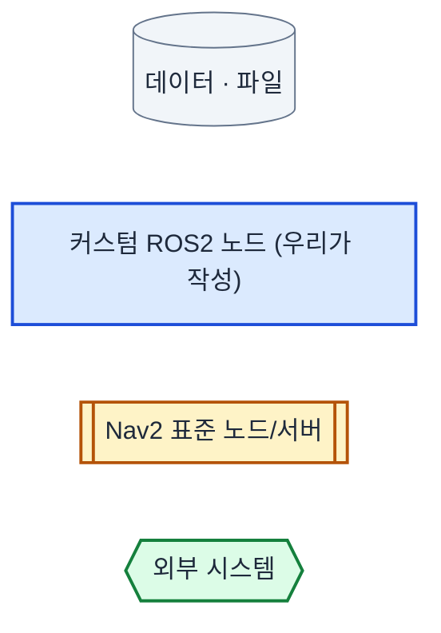
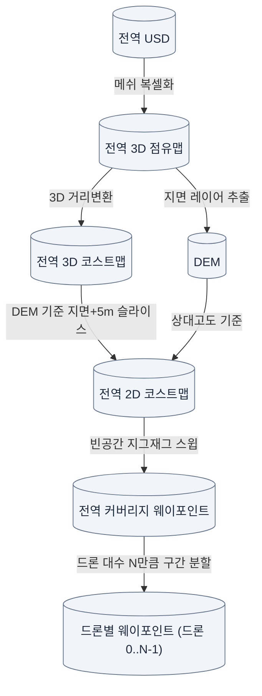
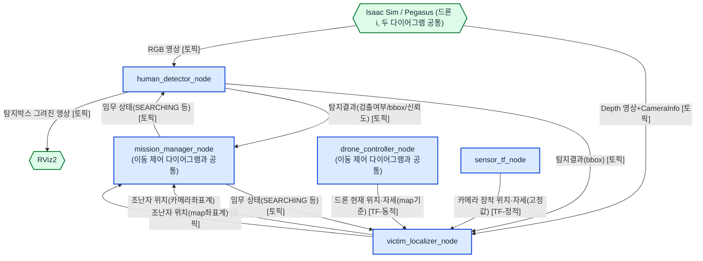
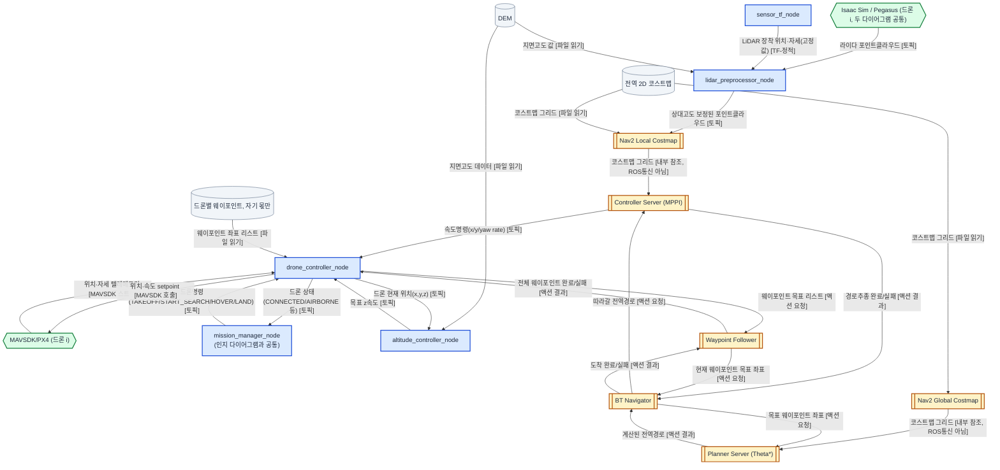
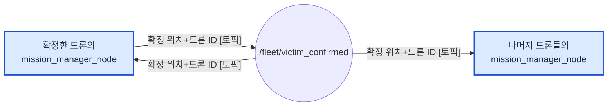
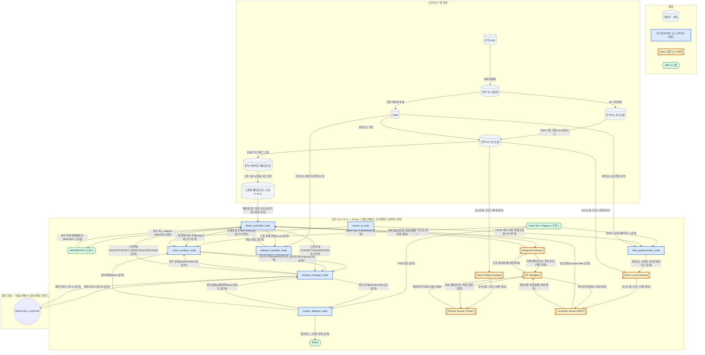

# 산림 조난자 탐지 드론 기본 시스템 구조

> 경로 계획 상세는 [산림구조드론_경로계획_기술정리.md](산림구조드론_경로계획_기술정리.md) 참고.

드론 N대(설정값)가 동시 수색한다. 아래 "드론 i" 블록(7개 커스텀 노드 + Nav2 스택)은 드론마다 `/drone_0` ~ `/drone_{N-1}` 네임스페이스로 하나씩 반복 실행되고, 조난자 확정 여부만 네임스페이스 없는 공유 토픽으로 함대 전체가 공유한다.

## 파이프라인 한눈에 보기

한 그림에 다 넣으면 선이 겹쳐 안 보이므로, 아래처럼 5개로 나눠서 본다. 색/도형 의미는 범례 하나로 공용.

### 범례



### 오프라인 — 맵 생성

> 이 파이프라인은 ROS 통신(토픽/서비스/액션)이 아니라 배치 스크립트의 파일→파일 처리다. 화살표 라벨은 처리 방법(=이 단계에서 만들어지는 데이터)을 뜻한다.



### 드론 i — 인지 (탐지 · 위치추정), `/drone_i` 네임스페이스로 드론마다 반복



### 드론 i — 이동 제어 (Nav2 + MAVSDK), `/drone_i` 네임스페이스로 드론마다 반복



### 함대 조율 — 네임스페이스 없이 전체 드론이 공유



### 전체 (참고용 — 위 5개를 합친 그림, 선이 많아 복잡함)



## 인터페이스 목록

다이어그램의 엣지 라벨은 데이터 중심으로 적었기 때문에, 실제 토픽/액션/TF 이름은 여기서 확인한다. **출처** 열: "코드 확인" = 기존 프로토타입 코드에 실제로 있는 이름, "Nav2 표준" = Nav2가 정의한 표준 이름, "이 설계 신규" = 이번 Nav2 통합 설계에서 새로 필요해진 것(아직 구현 없음), "이름 미정" = 신규 인터페이스인데 이름 자체도 아직 안 정함.

### 토픽 (Topic)

| 이름 | 메시지 타입 | 데이터 | 발행 | 구독 | 출처 |
|---|---|---|---|---|---|
| `/quadrotor/Camera/rgb` | `sensor_msgs/Image` | RGB 영상 | Isaac Sim | human_detector_node | 코드 확인 |
| `/quadrotor/Camera/depth` | `sensor_msgs/Image` | Depth 영상 | Isaac Sim | victim_localizer_node | 코드 확인 |
| `/quadrotor/Camera/camera_info` | `sensor_msgs/CameraInfo` | 카메라 내부파라미터 | Isaac Sim | victim_localizer_node | 코드 확인 |
| `/victim/detection` | `forest_rescue_interfaces/VictimDetection` | 검출여부/bbox/신뢰도 | human_detector_node | mission_manager_node, victim_localizer_node | 코드 확인 |
| `/victim/annotated_image` | `sensor_msgs/Image` | 탐지박스 그려진 영상 | human_detector_node | RViz2 | 코드 확인 |
| `/victim/position_camera` | `geometry_msgs/PointStamped` | 조난자 위치(카메라좌표계) | victim_localizer_node | mission_manager_node | 코드 확인 |
| `/victim/position_map` | `geometry_msgs/PointStamped` | 조난자 위치(map좌표계) | victim_localizer_node | mission_manager_node | 코드 확인 |
| `/mission/state` | `std_msgs/String` | 임무 상태(IDLE/SEARCHING/COMPLETE 등) | mission_manager_node | human_detector_node, victim_localizer_node | 코드 확인 |
| `/drone/status` | `std_msgs/String` | 드론 상태(CONNECTED/AIRBORNE 등) | drone_controller_node | mission_manager_node | 코드 확인 |
| `/drone/command` | `std_msgs/String` | `TAKEOFF`/`START_SEARCH`/`HOVER`/`LAND` | mission_manager_node | drone_controller_node | 코드 확인 |
| 라이다 PointCloud2 (예: `/point_cloud`) | `sensor_msgs/PointCloud2` | 원본 라이다 포인트클라우드 | Isaac Sim | lidar_preprocessor_node | 코드 확인(기존 obstacle_monitor_node 기준값 재사용 추정) |
| 지면상대고도 보정 포인트클라우드 | `sensor_msgs/PointCloud2` | 상대고도 보정된 포인트클라우드 | lidar_preprocessor_node | Local Costmap (Voxel Layer) | 이 설계 신규 · **이름 미정** |
| `/cmd_vel` (드론 네임스페이스 하위) | `geometry_msgs/Twist` | 속도명령(x/y/yaw rate) | Controller Server | drone_controller_node | Nav2 표준 |
| 드론 현재위치 전달 토픽 | `geometry_msgs/PointStamped` 등 | 드론 현재 위치(x,y,z) | drone_controller_node | altitude_controller_node | 이 설계 신규 · **이름 미정** |
| 목표 z속도 전달 토픽 | 미정 | 목표 z속도 | altitude_controller_node | drone_controller_node | 이 설계 신규 · **이름 미정** |
| `/fleet/victim_confirmed` | `forest_rescue_interfaces/VictimConfirmed`(신규) | 확정 위치 + 드론 ID | 확정한 드론의 mission_manager_node | 모든 드론의 mission_manager_node | 이 설계 신규 |

### 액션 (Action)

| 이름 | 액션 타입 | 목표(Goal) / 결과(Result) | 호출(Client) | 서버(Server) | 출처 |
|---|---|---|---|---|---|
| `ComputePathToPose` | `nav2_msgs/action/ComputePathToPose` | 목표: 웨이포인트 좌표 / 결과: 계산된 전역경로 | BT Navigator | Planner Server (Theta*) | Nav2 표준 |
| `FollowPath` | `nav2_msgs/action/FollowPath` | 목표: 전역경로 / 결과: 추종 완료·실패 | BT Navigator | Controller Server (MPPI) | Nav2 표준 |
| `NavigateToPose` | `nav2_msgs/action/NavigateToPose` | 목표: 웨이포인트 좌표 / 결과: 도착 완료·실패 | Waypoint Follower | BT Navigator | Nav2 표준 |
| `FollowWaypoints` | `nav2_msgs/action/FollowWaypoints` | 목표: 웨이포인트 좌표 리스트 / 결과: 전체 완료·실패 | drone_controller_node | Waypoint Follower | Nav2 표준 |

### 서비스 (Service)

| 이름 | 타입 | 용도 | 호출 | 서버 | 출처 |
|---|---|---|---|---|---|
| `/mission/start` | `std_srvs/Trigger` | 임무 시작 지시 | 오퍼레이터(외부) | mission_manager_node | 코드 확인 |
| `/mission/land` | `std_srvs/Trigger` | 착륙 지시 | 오퍼레이터(외부) | mission_manager_node | 코드 확인 |

### TF

| 관계 | 종류 | 데이터 | 발행 | 참조하는 곳 | 출처 |
|---|---|---|---|---|---|
| `map → base_link` | 동적 (`/tf`) | 드론 현재 위치·자세 | drone_controller_node | victim_localizer_node, Nav2 전체(코스트맵/Planner/Controller Server) | 코드 확인 |
| `base_link → Camera` | 정적 (`/tf_static`) | 카메라 장착 위치·자세(고정값) | sensor_tf_node | victim_localizer_node | 코드 확인 |
| `base_link → base_scan` | 정적 (`/tf_static`) | LiDAR 장착 위치·자세(고정값) | sensor_tf_node | lidar_preprocessor_node | 코드 확인 |

### MAVSDK (ROS 통신 아님 — SDK 자체 프로토콜)

| 항목 | 방향 | 데이터 | 출처 |
|---|---|---|---|
| 텔레메트리 스트림 (`position_velocity_ned`, `attitude_euler`, `position`, `health`, `in_air`) | PX4 → drone_controller_node | 위치/자세/상태 | 코드 확인 |
| Offboard setpoint (`set_position_ned`, `set_velocity_body`) | drone_controller_node → PX4 | 위치명령(`PositionNedYaw`) / 속도명령(`VelocityBodyYawspeed`) | `set_position_ned`는 코드 확인, `set_velocity_body`는 이 설계 신규 |
| Action 호출 (`arm`, `takeoff`, `land`) | drone_controller_node → PX4 | 이착륙 제어 | 코드 확인 |

### 파일 (ROS 통신 아님 — 오프라인 산출물)

| 경로 | 포맷 | 내용 | 만드는 곳 | 읽는 곳 | 출처 |
|---|---|---|---|---|---|
| `maps/forest_world_costmap.yaml` + `.pgm` | `nav2_map_server` 포맷 | 전역 2D 코스트맵 | 오프라인 맵 파이프라인 | Nav2 Global/Local Costmap (Static Layer) | 이 설계 신규 |
| `maps/forest_world_dem.npy` + `.yaml` | float32 2D 배열 | 지면고도(DEM) | 오프라인 맵 파이프라인 | lidar_preprocessor_node, altitude_controller_node | 이 설계 신규 |
| `maps/forest_world_waypoints_drone{i}.yaml` | 좌표 리스트 | 드론별 웨이포인트 | 오프라인 맵 파이프라인 | drone_controller_node | 이 설계 신규 |

## 전체 데이터 흐름

### 오프라인 — 맵 생성 (경로계획 문서 3장)

```text
[전역 USD] → 메쉬 복셀화 → 전역 3D 점유맵 → 3D 거리변환 → 전역 3D 코스트맵
                                  │                              │
                          지면 레이어 추출                DEM 기준 지면+5m 슬라이스
                                  ▼                              ▼
                        DEM(.npy+.yaml) ──(상대고도 기준)──→ 전역 2D 코스트맵(YAML+PGM)
                                                                   │
                                                           빈 공간 지그재그 스윕
                                                                   ▼
                                                    전역 커버리지 웨이포인트(YAML)
                                                                   │
                                                       드론 대수 N만큼 구간 분할 + 이동거리 균형 보정
                                                                   ▼
                                  드론별 웨이포인트 (forest_world_waypoints_drone{i}.yaml, i=0..N-1)
```

### 런타임 (드론 i — `/drone_i` 네임스페이스, N대 각각 동일 구조 반복)

```text
mission_manager_node ──임무 상태(SEARCHING 등) [토픽 /mission/state]──→ human_detector_node, victim_localizer_node
                                          (둘 다 SEARCHING 상태일 때만 동작)
drone_controller_node ──드론 상태(CONNECTED/AIRBORNE 등) [토픽 /drone/status]──→ mission_manager_node
sensor_tf_node ──카메라 장착 위치·자세(고정값) [TF-정적 base_link→Camera]──→ victim_localizer_node (카메라→map 변환에 필요)
sensor_tf_node ──LiDAR 장착 위치·자세(고정값) [TF-정적 base_link→base_scan]──→ lidar_preprocessor_node (라이다→base_link 변환에 필요)

Isaac Sim / Pegasus (드론 i)
 ├─ rgb ───→ human_detector_node ─┬─ 탐지결과(bbox) ─→ victim_localizer_node (아래)
 │                                ├─ 탐지결과 ─────→ mission_manager_node
 │                                └─ 탐지시각화 ────→ RViz2
 ├─ 뎁스 ──→ victim_localizer_node ─┬─ 위치(카메라기준) ─→ mission_manager_node
 │           (map 좌표 변환 시 drone_controller_node의 TF map→base_link +
 │            sensor_tf_node의 TF base_link→Camera 둘 다 필요)
 │                                  └─ 위치(맵기준) ────→ mission_manager_node
 └─ 라이다 ─→ lidar_preprocessor_node ←── DEM (지면고도 조회)
                  │ (DEM 기준 지면 상대 고도로 변환)
                  ▼
              Nav2 Local Costmap (Static Layer + Voxel Layer + Inflation Layer)

전역코스트맵 ──────────────────→ Nav2 Global Costmap (Static Layer)
전역코스트맵 ──────────────────→ Nav2 Local Costmap (Static Layer, 위와 동일 맵을 기반으로 깔고 시작)
드론별 웨이포인트(자기 몫, drone_i) ─→ drone_controller_node (START_SEARCH 수신 시 FollowWaypoints 액션으로
                                    Waypoint Follower에 전달 → Waypoint Follower가 BT Navigator의
                                    NavigateToPose를 웨이포인트마다 순차 호출 → BT Navigator가 완료/실패
                                    결과를 Waypoint Follower에 반환 → Waypoint Follower가 다음 웨이포인트로
                                    진행하거나, 전체 리스트 완료/실패 결과를 drone_controller_node에 반환)

Nav2 Global Costmap ──→ Planner Server (Theta*)
Nav2 Local Costmap  ──→ Controller Server (MPPI)

BT Navigator가 웨이포인트마다 Planner Server에 ComputePathToPose를 호출 → Planner Server가 전역경로를
반환 → BT Navigator가 그 경로를 담아 Controller Server에 FollowPath를 호출해 실행시킴 → Controller
Server가 완료/실패 결과를 BT Navigator에 반환. Controller Server는 그 사이 매 제어주기 속도명령을
직접 publish.

Controller Server ──────────────────────── 속도명령(x/y/yaw rate) ──┐
DEM ──→ altitude_controller_node(현재위치는 drone_controller_node에서) ─┤ z속도
mission_manager_node ── 드론명령(TAKEOFF/START_SEARCH/HOVER/LAND) ────┤
                                                                      ▼
                                                         drone_controller_node
                                                                      │
                                      TAKEOFF/HOVER/LAND: 위치명령 직접 실행
                                      START_SEARCH: FollowWaypoints 호출 + 속도명령 병합
                                                                      ▼
                                                                 MAVSDK/PX4 (드론 i, 고유 포트)
                                                                      │
                                              텔레메트리(위치/자세) ────┘ (drone_controller_node,
                                                                          altitude_controller_node로 전달)
```

### 함대 조율 (네임스페이스 없음, 전체 드론 공유)

```text
드론 i의 mission_manager_node: 연속탐지 확정+Hover+위치(카메라기준) 확보 ──┐
                                                                        ▼
                                          [토픽] /fleet/victim_confirmed — 데이터: 확정 위치 + 드론 ID (네임스페이스 없음)
                                                                        │
                              ┌─────────────────────────────────────────┴─────────────────────────────────────────┐
                              ▼                                                                                     ▼
             드론 i 자신의 mission_manager_node                                          드론 j(≠i)의 mission_manager_node
             (기존과 동일하게 COMPLETE 처리, HOVER)                                    (아직 못 찾았어도 그 자리에서 HOVER로 전환)
```

## 팀원별 고정 인터페이스

### 환경 모델링

- 유지해야 하는 드론 Prim: `/World/quadrotor_{i}` (i=0..N-1, 드론 대수만큼 배치)
- 유지해야 하는 카메라 Prim: `/World/quadrotor_{i}/body/Camera`
- 드론 N대는 모두 동일한 공통 출발점에 배치한다 (경로계획 문서 3.3.2절의 "공통 출발점" 전제)
- 현재 조난자 객체 이름: `victim_01`
- 최종 산출물 권장 위치: `isaac_sim/worlds/forest_world.usd`
- 오프라인 맵 생성 파이프라인(경로계획 문서 3장)의 소스
- `sensor_tf_node`(정적 TF `base_link→Camera`, `base_link→base_scan` 발행)의 translation/quaternion 파라미터가 USD상 카메라·LiDAR 실제 장착 위치와 일치해야 한다. 드론마다(`/drone_i`) 별도 실행되지만 파라미터 값은 동일(카메라/LiDAR 상대 위치는 드론 기종이 같으면 동일).

### 사람 탐지 모델

- 입력: `/quadrotor/Camera/rgb` (`sensor_msgs/Image`)
- 출력: `/victim/detection` (`forest_rescue_interfaces/VictimDetection`)
- 시각화: `/victim/annotated_image` (`sensor_msgs/Image`)
- `/mission/state`(`std_msgs/String`, `mission_manager_node` 발행)를 구독해 `SEARCHING` 상태일 때만 추론 수행 — `victim_localizer_node`도 동일하게 이 상태로 게이팅
- 드론마다 별도 프로세스로 실행되며 `/drone_i` 네임스페이스 하위에 위치. 노드 코드 자체는 드론 대수와 무관하게 동일하다.
- 팀원은 `human_detector_node.py` 내부 추론부나 YAML의 `model_path`만 교체한다.

### 경로 계획 (Nav2)

- 전역 경로: `nav2_theta_star_planner` (Planner Server), 매 구간(현재 위치 → 다음 웨이포인트)마다 BT Navigator가 호출. 입력은 오프라인 생성된 전역 2D 코스트맵(Static Layer)
- 지역 경로/회피: `nav2_mppi_controller` (Controller Server), 입력은 Local Costmap. Local Costmap 자체는 전역 2D 코스트맵을 Static Layer로 깔고 그 위에 Voxel Layer(실시간 LiDAR) + Inflation Layer를 얹은 구성
- 웨이포인트 순회: `nav2_waypoint_follower`(`FollowWaypoints` 액션) — 드론별 웨이포인트 리스트를 순서대로 순회하며 매 지점마다 Theta*/MPPI를 새로 호출. `drone_controller_node`가 직접 호출
- 오프라인 맵 파이프라인(경로계획 문서 3장 2~4·6~7단계: 복셀화/거리변환/DEM·2D코스트맵/전역 커버리지 웨이포인트/드론별 배분)도 이 팀이 담당
- 오프라인 산출물 포맷
  - 전역 2D 코스트맵: `maps/forest_world_costmap.yaml` + `.pgm` (`nav2_map_server` 포맷, `trinary_costmap: false`로 0~100 그레이디드 값 반영)
  - DEM: `maps/forest_world_dem.npy`(float32 2D 배열) + `maps/forest_world_dem.yaml`(resolution/origin_x/origin_y/width/height)
  - 드론별 웨이포인트: `maps/forest_world_waypoints_drone{i}.yaml` (i=0..N-1, 지그재그 스윕 순서의 좌표 리스트를 드론 대수만큼 연속 구간으로 분할)
- **Nav2 스택은 드론마다 `/drone_i` 네임스페이스로 완전히 별도 실행**(Global/Local Costmap, Planner/Controller Server, BT Navigator, Waypoint Follower 전부 드론당 1세트). Global Costmap도 모든 드론이 동일 정적 파일을 각자 로드하는 구조이며, 런타임에 공유되는 노드는 없다.
- `lidar_preprocessor_node`
  - 입력: LiDAR PointCloud2, DEM 파일(포인트별 (x,y) 위치의 지면고도 조회용)
  - 출력: DEM 기준 지면 상대 고도로 변환된 PointCloud2 → Local Costmap Voxel Layer
- `altitude_controller_node`
  - 입력: DEM 파일, 드론 현재 x,y,z (`drone_controller_node`가 MAVSDK 텔레메트리로 받아 전달)
  - 출력: z velocity(목표 고도 지면+5m 대비 P 제어, climb/descend rate 상한 clamp) → `drone_controller_node`
- `drone_controller_node`는 `nav2_active=True`(SEARCH 중)일 때만 매 tick `cmd_vel`(forward/right/yawspeed)과 `altitude_controller_node`의 z velocity를 `set_velocity_body(VelocityBodyYawspeed)` 하나로 합쳐 MAVSDK에 전달
- `drone_controller_node`는 실행 시 자신의 드론 인덱스 `i`를 파라미터로 받아 `maps/forest_world_waypoints_drone{i}.yaml`을 로드하고, 자신의 `system_address`(MAVSDK 접속 포트)도 드론마다 다르게 설정한다.

### 드론 이동 제어

- 명령 입력: `/drone/command` (`std_msgs/String`) — `TAKEOFF`, `START_SEARCH`, `HOVER`, `LAND` 전부 `drone_controller_node`가 직접 처리 (다른 노드로 위임하지 않음)
- `START_SEARCH` 수신 시 `drone_controller_node`가 자기 몫의 드론별 웨이포인트(`maps/forest_world_waypoints_drone{i}.yaml`)를 목표로 `FollowWaypoints` 액션을 직접 호출하고 `nav2_active = True`로 설정
- 상태 출력: `/drone/status` (`std_msgs/String`) — `mission_manager_node`가 구독해 자동 이륙 등 상태 전이 판단에 사용
- 저수준 실행: `TAKEOFF`/`HOVER`/`LAND`는 `PositionNedYaw`로 직접 실행. `START_SEARCH` 중(`nav2_active = True`)에는 `cmd_vel`과 `altitude_controller_node`의 z velocity를 `set_velocity_body(VelocityBodyYawspeed)`로 합쳐 실행
- `HOVER`/`LAND` 수신 시 `drone_controller_node`가 즉시 `nav2_active = False`로 내려 `cmd_vel` 처리를 중단하고, 자신이 호출했던 `FollowWaypoints` 액션의 goal handle로 `cancel_goal_async()`를 호출한 뒤 `PositionNedYaw`를 실행한다
- 팀원은 `drone_controller_node.py`에서 Nav2/고도 제어 출력을 MAVSDK 호출로 변환하는 부분을 담당한다.
- MAVSDK 텔레메트리(위치/자세)를 구독해 현재 위치를 유지하며(HOVER 등에 사용), `altitude_controller_node`에도 현재 위치를 전달한다.
- MAVSDK 텔레메트리 기반으로 `map → base_link` TF를 발행한다 (`victim_localizer_node`의 카메라→map 좌표 변환, Nav2 전체(코스트맵/Planner/Controller Server)가 공통으로 참조). 나머지 구간(`base_link → Camera`, `base_link → base_scan`)은 `sensor_tf_node`가 별도로 발행하며, 이 둘이 합쳐져야 전체 TF 체인이 완성된다.
- 드론마다 별도 프로세스로 실행되며(`/drone_i` 네임스페이스), MAVSDK `system_address`(연결 포트)도 드론마다 고유해야 한다.

### 함대 조율 (신규 — 드론이 2대 이상일 때만 의미 있음)

- `/fleet/victim_confirmed` (`forest_rescue_interfaces/VictimConfirmed` — 신규 메시지, `PointStamped position` + `int32 drone_id` 필드 필요. 기존 `VictimDetection`과 같은 패키지에 추가): 네임스페이스 없는 공유 토픽
- `mission_manager_node`는 연속 탐지 확정(`victim_confirmed`) + Hover 상태 + 위치(카메라기준) 확보 세 조건이 모두 되면(`COMPLETE` 전환 시점) 이 토픽을 발행한다. 위치(맵기준)은 TF 준비 여부에 따라 늦게 오거나 못 올 수 있어 필수 조건이 아니다 — 대신 `VictimConfirmed`의 `position` 필드는 이때까지 확보된 좌표(맵기준이 있으면 그것, 없으면 카메라기준)를 담는다.
- 모든 드론의 `mission_manager_node`가 이 토픽을 구독한다. 자신이 아직 `COMPLETE`가 아닌 상태에서 이 토픽을 받으면(= 다른 드론이 먼저 찾음), 자신의 `START_SEARCH`를 중단하고 그 자리에서 `HOVER`로 전환하며, `/mission/state`도 `COMPLETE`로 갱신한다 — 이를 통해 `human_detector_node`/`victim_localizer_node`도 기존 게이팅 로직 그대로 자연히 탐지를 멈춘다.
- 드론 1대만 쓰는 경우 이 토픽은 자기 자신에게만 도달하므로 기존 단일 드론 동작과 동일하게 작동한다.

## 현재 기본값과 한계

- 카메라: focal length 18mm, 약 60도 수평 FOV, 아래쪽 30도
- 비행 고도: 지면 기준 5m 유지 (지형 추종, DEM 기준 — [경로계획 문서 7장](산림구조드론_경로계획_기술정리.md#7-지형-고저차-대응-지면-상대-고도-보정) 참고)
- 드론 대수 N은 설정값이며, 드론별 웨이포인트 배분(경로계획 문서 3.3절)은 N이 스윕 줄 개수보다 많은 경우(N > R)를 아직 다루지 않는다
- 탐색 Yaw: 0도(초기 Hover에서는 현재 PX4 Yaw 유지)
- 탐지 후: 발견한 드론과 나머지 드론 모두 출발점으로 복귀하지 않고 그 자리에서 Hover (함대 조율 절 참고)
- Mock 지연 시간은 `SEARCHING` 진입 시점부터 계산한다.
- 최초 유효 조난자 위치는 임무가 끝날 때까지 고정한다.
- Mock 탐지는 연결 검증용이며 실제 사람 인식 성능을 의미하지 않는다.
- 동적 TF는 MAVSDK NED 위치를 ROS ENU로 변환하고, 기본 버전에서는 roll/pitch를 생략한다. `map → odom → base_link` 체인 정합 여부 확인 필요
- 오프라인 맵 생성 파이프라인의 복셀화/거리변환 구현 도구는 미정 (산출물 포맷·경로는 확정)
- 로컬 회피(MPPI)로 인해 일부 커버리지 웨이포인트 구간이 스킵될 수 있음 — 재탐색 로직은 추후 과제 (드론별로 독립 발생 가능)
- 드론마다 MAVSDK 연결 포트(`system_address`)를 다르게 설정해야 하며, 이 매핑(드론 인덱스 ↔ 포트 ↔ 웨이포인트 파일)을 관리하는 launch 구성은 아직 없음
- `/mission/start`·`/mission/land` 서비스는 드론별로 네임스페이스가 분리돼 있어, N대를 동시에 출발시키려면 오퍼레이터가 N번 호출하거나 이를 한 번에 묶어 호출하는 별도 오케스트레이션(스크립트 또는 함대 공용 서비스)이 필요함 — 아직 미정
- **드론 간 충돌 회피 메커니즘 없음**: 각 드론의 Local Costmap은 자기 LiDAR로 본 환경 장애물만 반영하고 다른 드론은 장애물로 인식하지 못한다. 담당 구역이 공간적으로 분리되어 있어도 공통 출발점 근처(동시 이륙 후 각자 구역으로 흩어지는 구간)는 아직 분리가 안 된 상태이고, 전 드론이 동일 고도(지면+5m)로 비행해 수직 분리도 없다 — 열린 문제로 남김
