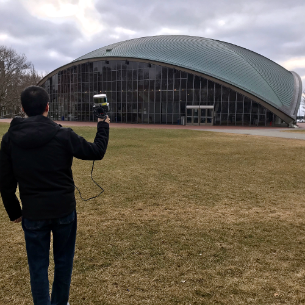
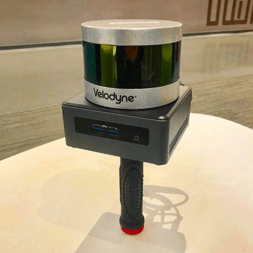
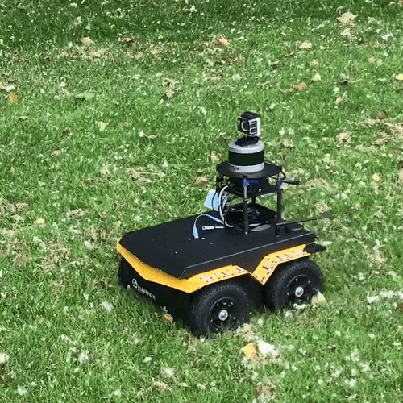
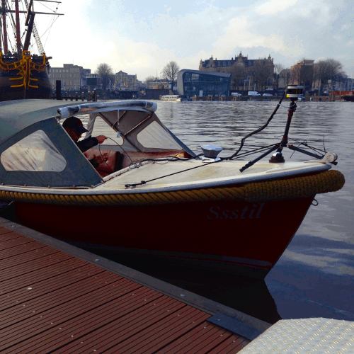
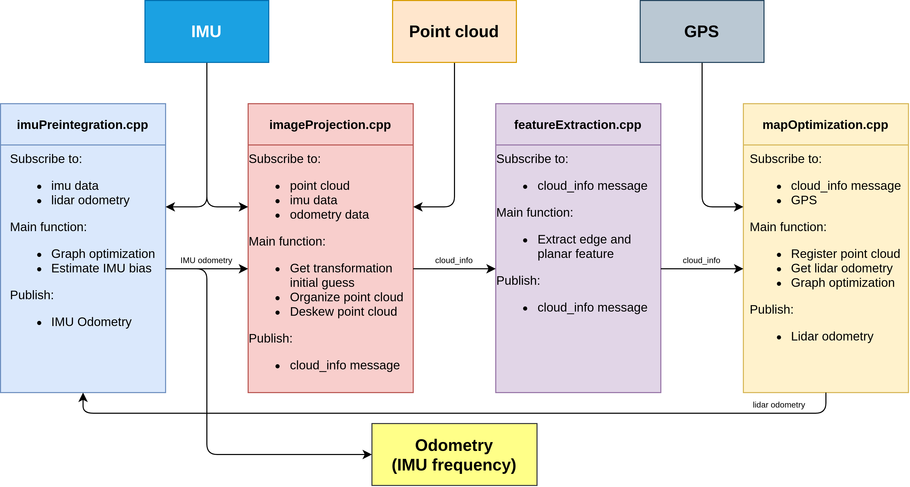
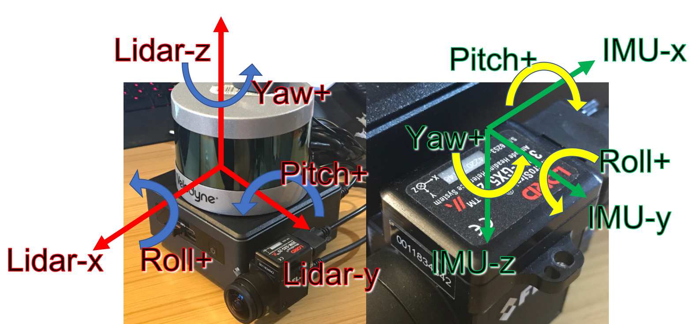
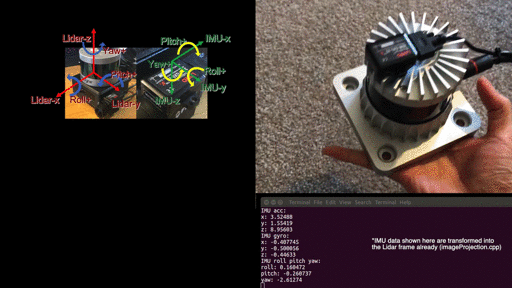
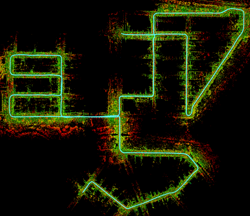
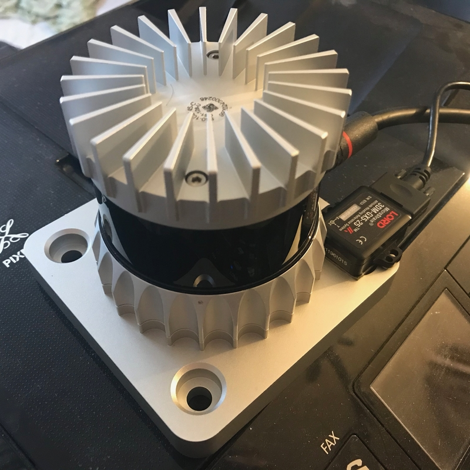

# LIO-SAM

**실시간 라이다-관성 오도메트리(lidar-inertial odometry) 패키지입니다. 사용자는 이 문서를 꼼꼼히 읽고, 먼저 제공된 데이터셋으로 패키지를 테스트해 볼 것을 강력히 권장합니다. 방법에 대한 시연 영상은 [YouTube](https://www.youtube.com/watch?v=A0H8CoORZJU)에서 확인할 수 있습니다.**

<p align='center'>
    
</p>

<p align='center'>
    
    
    
    
</p>

## 목차

  - [**시스템 구조**](#시스템-구조)

  - [**ROS2 브랜치 관련 참고사항**](#ros2-브랜치-관련-참고사항)

  - [**패키지 의존성**](#의존성)

  - [**패키지 설치**](#설치)

  - [**라이다 데이터 준비**](#라이다-데이터-준비) (필독)

  - [**IMU 데이터 준비**](#imu-데이터-준비) (필독)

  - [**샘플 데이터셋**](#샘플-데이터셋)

  - [**패키지 실행**](#패키지-실행)

  - [**기타 참고사항**](#기타-참고사항)

  - [**이슈**](#이슈)

  - [**논문**](#논문)

  - [**TODO**](#todo)

  - [**관련 패키지**](#관련-패키지)

  - [**감사의 말**](#감사의-말)

## 시스템 구조

<p align='center'>
    
</p>

두 개의 그래프를 유지하면서 실시간 대비 최대 10배 빠르게 동작하는 시스템을 설계했습니다.
  - "mapOptimization.cpp"의 factor graph는 라이다 오도메트리 factor와 GPS factor를 최적화합니다. 이 factor graph는 테스트 전체 과정 동안 일관되게 유지됩니다.
  - "imuPreintegration.cpp"의 factor graph는 IMU와 라이다 오도메트리 factor를 최적화하고 IMU 바이어스를 추정합니다. 이 factor graph는 주기적으로 리셋되며, IMU 주파수 수준의 실시간 오도메트리 추정을 보장합니다.

## ROS2 브랜치 관련 참고사항

원본 ROS1 버전에 있던 일부 기능은 현재 이 ROS2 버전에는 빠져 있습니다:
- Velodyne & Livox 라이다, Microstrain IMU를 사용한 테스트
- navsat 모듈/GPS factor용 launch 파일
- rviz2 설정에 많은 요소가 누락되어 있음

이 브랜치는 다음 ROS2 드라이버를 사용하여 Ouster 라이다, Xsens IMU, SBG-Systems IMU로 테스트되었습니다:
- [ros2_ouster_drivers](https://github.com/ros-drivers/ros2_ouster_drivers)
- [bluespace_ai_xsens_ros_mti_driver](https://github.com/bluespace-ai/bluespace_ai_xsens_ros_mti_driver)
- [sbg_ros2_driver](https://github.com/SBG-Systems/sbg_ros2_driver)

이 테스트들에서 IMU는 라이다 하단에, x축이 서로 같은 방향을 향하도록 장착되었습니다. `params.yaml`의 `extrinsicRot`과 `extrinsicRPY` 파라미터는 이 구성에 대응합니다.

## 의존성

Ubuntu 20.04의 ROS2 foxy, galactic 버전과 Ubuntu 22.04의 humble 버전에서 테스트되었습니다.
- [ROS2](https://docs.ros.org/en/humble/Installation.html)
  ```
  sudo apt install ros-<ros2-version>-perception-pcl \
		   ros-<ros2-version>-pcl-msgs \
		   ros-<ros2-version>-vision-opencv \
		   ros-<ros2-version>-xacro
  ```
- [gtsam](https://gtsam.org/get_started) (Georgia Tech Smoothing and Mapping library)
  ```
  # Add GTSAM-PPA
  sudo add-apt-repository ppa:borglab/gtsam-release-4.1
  sudo apt install libgtsam-dev libgtsam-unstable-dev
  ```

## 설치

다음 명령어를 사용하여 패키지를 다운로드하고 빌드하세요.

  ```
  cd ~/ros2_ws/src
  git clone https://github.com/TixiaoShan/LIO-SAM.git
  cd lio-sam
  git checkout ros2
  cd ..
  colcon build
  ```

## 라이다 데이터 준비

사용자는 주로 "imageProjection.cpp"에서 이루어지는 클라우드 디스큐(deskew, 왜곡 보정)를 위해 올바른 형식의 포인트 클라우드 데이터를 준비해야 합니다. 두 가지 요구사항은 다음과 같습니다:
  - **포인트 타임스탬프 제공**. LIO-SAM은 IMU 데이터를 사용하여 포인트 클라우드 디스큐를 수행합니다. 따라서 스캔 내 각 포인트의 상대 시간이 필요합니다. 최신 Velodyne ROS 드라이버는 이 정보를 직접 출력해야 합니다. 여기서는 포인트 시간 채널의 이름이 "time"이라고 가정합니다. 포인트 타입의 정의는 "imageProjection.cpp" 상단에 있습니다. "deskewPoint()" 함수는 이 상대 시간을 이용해 해당 포인트가 스캔 시작 시점 대비 어떤 변환을 갖는지 계산합니다. 라이다가 10Hz로 회전할 경우, 포인트의 타임스탬프는 0~0.1초 사이의 값을 가져야 합니다. 다른 라이다 센서를 사용하는 경우, 이 시간 채널의 이름을 변경하고 그것이 스캔 내 상대 시간인지 확인해야 할 수 있습니다.
  - **포인트 링(ring) 번호 제공**. LIO-SAM은 이 정보를 사용하여 포인트를 행렬에 올바르게 정리합니다. 링 번호는 해당 포인트가 센서의 어느 채널에 속하는지를 나타냅니다. 포인트 타입의 정의는 "imageProjection.cpp" 상단에 있습니다. 최신 Velodyne ROS 드라이버는 이 정보를 직접 출력해야 합니다. 마찬가지로, 다른 라이다 센서를 사용하는 경우 이 정보의 이름을 변경해야 할 수 있습니다. 현재 이 패키지는 기계식(mechanical) 라이다만 지원한다는 점에 유의하세요.

## IMU 데이터 준비

  - **IMU 요구사항**. 원본 LOAM 구현과 마찬가지로, LIO-SAM은 롤(roll), 피치(pitch), 요(yaw)를 추정할 수 있는 9축 IMU에서만 동작합니다. 롤과 피치 추정은 주로 시스템을 올바른 자세로 초기화하는 데 사용됩니다. 요 추정은 GPS 데이터를 사용할 때 시스템을 올바른 헤딩(heading)으로 초기화합니다. 이론적으로는 VINS-Mono와 같은 초기화 절차를 사용하면 LIO-SAM이 6축 IMU로도 동작할 수 있습니다. 시스템의 성능은 IMU 측정값의 품질에 크게 좌우됩니다. IMU 데이터 레이트가 높을수록 시스템 정확도가 좋아집니다. 저희는 500Hz로 데이터를 출력하는 Microstrain 3DM-GX5-25를 사용했습니다. 최소 200Hz 출력 레이트를 갖는 IMU 사용을 권장합니다. Ouster 라이다의 내장 IMU는 6축 IMU라는 점에 유의하세요.

  - **IMU 정렬(alignment)**. LIO-SAM은 IMU 원시 데이터를 IMU 프레임에서 라이다 프레임으로 변환하며, 이는 ROS REP-105 규약(x - 전방, y - 좌측, z - 상방)을 따릅니다. 시스템이 올바르게 동작하려면 "params.yaml" 파일에 정확한 외부 파라미터(extrinsic) 변환을 제공해야 합니다. **외부 파라미터가 두 개 존재하는 이유는, 저희가 사용한 IMU(Microstrain 3DM-GX5-25)의 가속도와 자세(attitude)가 서로 다른 좌표계를 가지기 때문입니다. IMU 제조사에 따라 두 외부 파라미터가 같을 수도, 다를 수도 있습니다.**
    - "params.yaml"의 "extrinsicRot"은 IMU 자이로 및 가속도계 측정값을 라이다 프레임으로 변환하는 회전 행렬입니다.
    - "params.yaml"의 "extrinsicRPY"는 IMU 자세(orientation)를 라이다 프레임으로 변환하는 회전 행렬입니다.

  - **IMU 디버그**. 사용자는 "imageProjection.cpp"의 "imuHandler()" 안에 있는 디버그 라인의 주석을 해제하고 변환된 IMU 데이터의 출력을 테스트해 볼 것을 강력히 권장합니다. 센서 조립체를 회전시켜 보면서 측정값이 센서의 움직임과 일치하는지 확인할 수 있습니다. 보정된 IMU 데이터를 보여주는 YouTube 영상은 [여기(YouTube 링크)](https://youtu.be/BOUK8LYQhHs)에서 확인할 수 있습니다.


<p align='center'>
    
</p>
<p align='center'>
    
</p>

## 샘플 데이터셋

개인정보 보호상의 이유로, 현재 ROS2용으로 제공 가능한 데이터셋은 없습니다.

master 브랜치의 README.md에는 ROS1 rosbag 링크가 일부 포함되어 있습니다. 이 rosbag들을 [ros1_bridge](https://github.com/ros2/ros1_bridge)와 함께 사용하는 것은 가능하지만, 먼저 타이밍 동작(ROS2에서의 메시지 주파수)을 확인하세요. [DDS 튜닝](https://docs.ros.org/en/humble/How-To-Guides/DDS-tuning.html)도 참고하시기 바랍니다.

## 패키지 실행

1. launch 파일 실행:
```
ros2 launch lio_sam run.launch.py
```

2. 기존 bag 파일 재생:
```
ros2 bag play your-bag.bag
```

## 맵 저장
```
ros2 service call /lio_sam/save_map lio_sam/srv/SaveMap
```
```
ros2 service call /lio_sam/save_map lio_sam/srv/SaveMap "{resolution: 0.2, destination: /Downloads/service_LOAM}"
```
## 기타 참고사항

  - **루프 클로저(Loop closure):** 여기서 제공하는 루프 함수는 개념 증명(proof of concept) 수준의 예시입니다. LeGO-LOAM의 루프 클로저를 그대로 가져온 것입니다. 더 발전된 루프 클로저 구현이 필요하다면 [ScanContext](https://github.com/irapkaist/SC-LeGO-LOAM)를 참고하세요. 루프 클로저 기능을 테스트하려면 "params.yaml"의 "loopClosureEnableFlag"를 "true"로 설정하세요. Rviz에서 "Map (cloud)"의 체크를 해제하고 "Map (global)"을 체크하세요. 시각화된 맵인 "Map (cloud)"는 단순히 Rviz 상에 쌓인 포인트 클라우드 더미이기 때문에, 포즈 보정 이후에도 위치가 갱신되지 않기 때문입니다. 여기서 사용하는 루프 클로저 기능은 LeGO-LOAM에서 그대로 가져온 것으로, ICP 기반 방식입니다. ICP는 실행 속도가 상당히 느리므로, 재생 속도를 "-r 1"로 설정할 것을 권장합니다. 테스트 시 Garden 데이터셋을 사용해 볼 수 있습니다.

<p align='center'>
    
    
</p>

  - **GPS 사용:** GPS 데이터를 이용한 LIO-SAM 테스트용으로 park 데이터셋이 제공됩니다. 이 데이터셋은 [Yewei Huang](https://robustfieldautonomylab.github.io/people.html)이 수집했습니다. GPS 기능을 활성화하려면 "params.yaml"의 "gpsTopic"을 "odometry/gps"로 변경하세요. Rviz에서 "Map (cloud)"의 체크를 해제하고 "Map (global)"을 체크하세요. 또한 "Odom GPS"를 체크하면 GPS 오도메트리가 시각화됩니다. "gpsCovThreshold"를 조정하여 품질이 낮은 GPS 측정값을 걸러낼 수 있습니다. "poseCovThreshold"는 그래프에 GPS factor를 추가하는 빈도를 조정하는 데 사용할 수 있습니다. 예를 들어, "poseCovThreshold"를 1.0으로 설정하면 궤적이 GPS에 의해 지속적으로 보정되는 것을 확인할 수 있습니다. iSAM 최적화 부하가 크기 때문에, 재생 속도를 "-r 1"로 설정할 것을 권장합니다.

<p align='center'>
    
</p>

  - **KITTI:** LIO-SAM은 정상 동작을 위해 고주파수 IMU가 필요하므로, 테스트에는 KITTI raw 데이터를 사용해야 합니다. 아직 해결되지 않은 문제 중 하나는 IMU의 내부 파라미터(intrinsics)를 알 수 없다는 점이며, 이는 LIO-SAM의 정확도에 큰 영향을 미칩니다. 제공된 샘플 데이터를 다운로드한 뒤 "params.yaml"에서 다음과 같이 변경하세요:
    - extrinsicTrans: [-8.086759e-01, 3.195559e-01, -7.997231e-01]
    - extrinsicRot: [9.999976e-01, 7.553071e-04, -2.035826e-03, -7.854027e-04, 9.998898e-01, -1.482298e-02, 2.024406e-03, 1.482454e-02, 9.998881e-01]
    - extrinsicRPY: [9.999976e-01, 7.553071e-04, -2.035826e-03, -7.854027e-04, 9.998898e-01, -1.482298e-02, 2.024406e-03, 1.482454e-02, 9.998881e-01]
    - N_SCAN: 64
    - downsampleRate: 2 또는 4
    - loopClosureEnableFlag: true 또는 false

<p align='center'>
    
    
</p>

  - **Ouster 라이다:** LIO-SAM을 Ouster 라이다와 함께 동작시키려면 하드웨어와 소프트웨어 수준에서 몇 가지 준비가 필요합니다.
    - 하드웨어:
      - 외부 IMU를 사용하세요. LIO-SAM은 Ouster 라이다의 내장 6축 IMU로는 동작하지 않습니다. 9축 IMU를 라이다에 장착하여 데이터를 수집해야 합니다.
      - 드라이버를 설정하세요. Ouster launch 파일의 "timestamp_mode"를 "TIME_FROM_PTP_1588"로 변경하면 포인트 클라우드에 ROS 형식의 타임스탬프를 사용할 수 있습니다.
    - 설정(Config):
      - "params.yaml"의 "sensor"를 "ouster"로 변경하세요.
      - 사용 중인 라이다에 맞게 "params.yaml"의 "N_SCAN"과 "Horizon_SCAN"을 변경하세요. 예: N_SCAN=128, Horizon_SCAN=1024.
    - Gen 1 및 Gen 2 Ouster:
      세대별로 포인트 좌표 정의가 다를 수 있는 것으로 보입니다. 디버깅 관련해서는 [Issue #94](https://github.com/TixiaoShan/LIO-SAM/issues/94)를 참고하세요.

<p align='center'>
    
    
</p>

## 이슈

  - **지그재그 또는 흔들리는(jerking) 움직임**: 라이다와 IMU 데이터 형식이 LIO-SAM의 요구사항에 부합한다면, 이 문제는 대체로 라이다와 IMU 데이터의 타임스탬프가 동기화되지 않아 발생합니다.

  - **위아래로 튀는 현상**: bag 파일 테스트를 시작하자마자 base_link가 위아래로 즉시 튀기 시작한다면, IMU 외부 파라미터(extrinsics)가 잘못되었을 가능성이 높습니다. 예를 들어, 중력 가속도가 음수 값을 가지는 경우입니다.

  - **mapOptimization 크래시**: 보통 GTSAM으로 인해 발생합니다. README.md에 명시된 GTSAM 버전을 설치하세요. 유사한 이슈들은 [여기](https://github.com/TixiaoShan/LIO-SAM/issues)에서 더 확인할 수 있습니다.

  - **gps odometry를 사용할 수 없음**: 일반적으로 메시지 frame_id와 로봇 frame_id 간의 transform이 존재하지 않아서 발생합니다(예: "imu_frame_id"와 "gps_frame_id"에서 "base_link" 프레임으로의 transform이 존재해야 함). [여기](http://docs.ros.org/en/melodic/api/robot_localization/html/preparing_sensor_data.html)에서 Robot Localization 문서를 읽어보세요.

## 논문

이 코드를 사용하신다면 [LIO-SAM (IROS-2020)](./config/doc/paper.pdf) 논문을 인용해 주시면 감사하겠습니다.
```
@inproceedings{liosam2020shan,
  title={LIO-SAM: Tightly-coupled Lidar Inertial Odometry via Smoothing and Mapping},
  author={Shan, Tixiao and Englot, Brendan and Meyers, Drew and Wang, Wei and Ratti, Carlo and Rus Daniela},
  booktitle={IEEE/RSJ International Conference on Intelligent Robots and Systems (IROS)},
  pages={5135-5142},
  year={2020},
  organization={IEEE}
}
```

코드 일부는 [LeGO-LOAM](https://github.com/RobustFieldAutonomyLab/LeGO-LOAM)에서 가져왔습니다.
```
@inproceedings{legoloam2018shan,
  title={LeGO-LOAM: Lightweight and Ground-Optimized Lidar Odometry and Mapping on Variable Terrain},
  author={Shan, Tixiao and Englot, Brendan},
  booktitle={IEEE/RSJ International Conference on Intelligent Robots and Systems (IROS)},
  pages={4758-4765},
  year={2018},
  organization={IEEE}
}
```

## TODO

  - [ ] [imuPreintegration 내 버그](https://github.com/TixiaoShan/LIO-SAM/issues/104)

## 관련 패키지

  - [Lidar-IMU calibration](https://github.com/chennuo0125-HIT/lidar_imu_calib)
  - [LIO-SAM with Scan Context](https://github.com/gisbi-kim/SC-LIO-SAM)

## 감사의 말

  - LIO-SAM은 LOAM(J. Zhang and S. Singh. LOAM: Lidar Odometry and Mapping in Real-time)을 기반으로 합니다.
# LIO-SAM-ROS2
# LIO-SAM-ROS2
